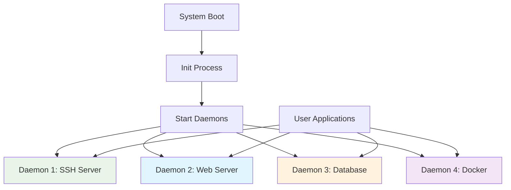
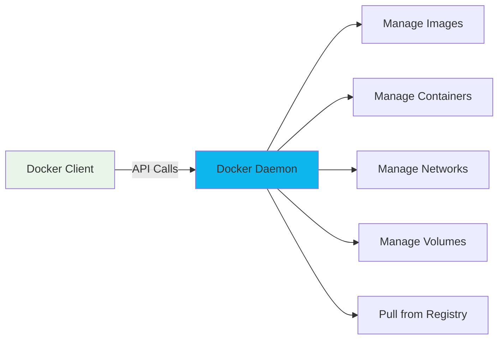
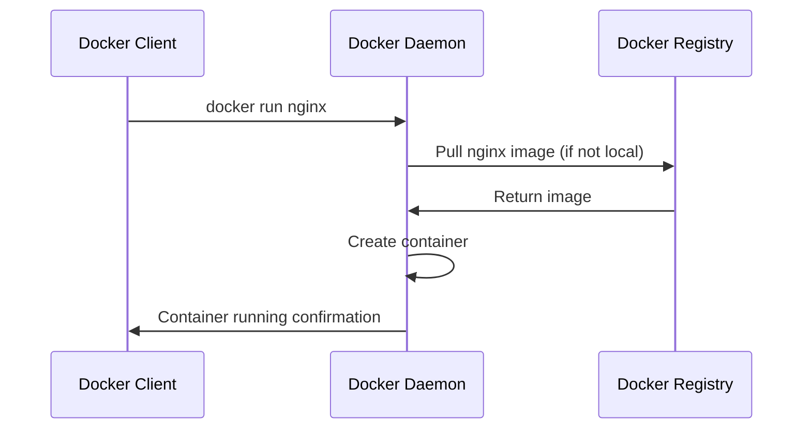
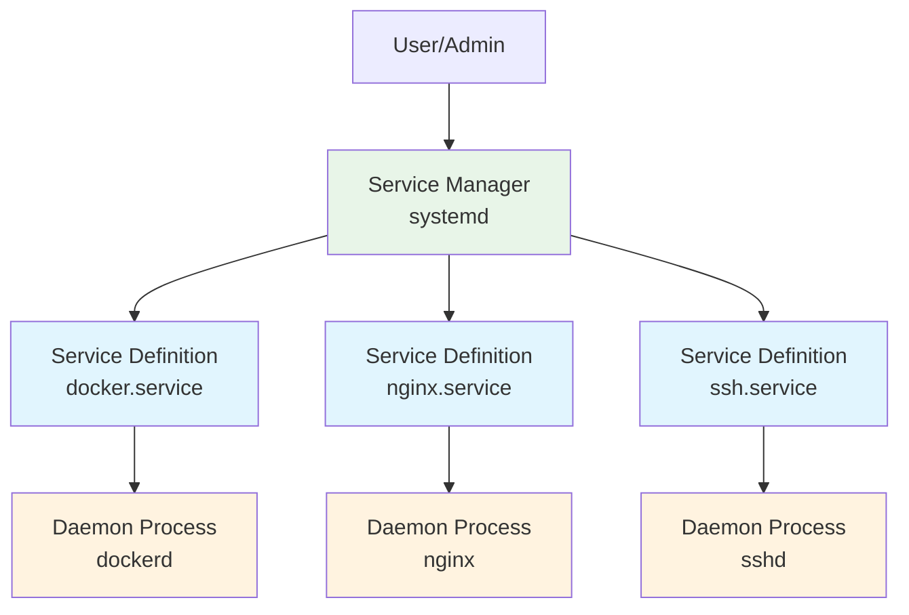
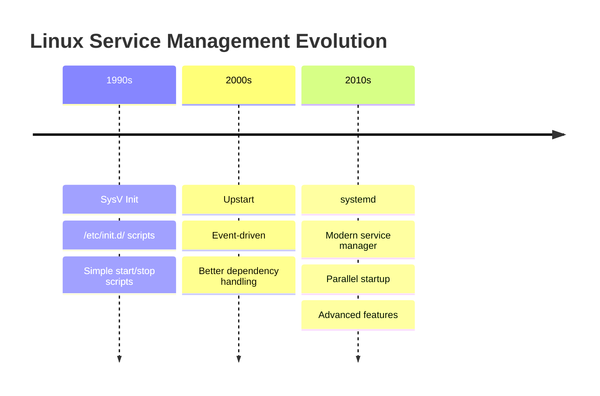
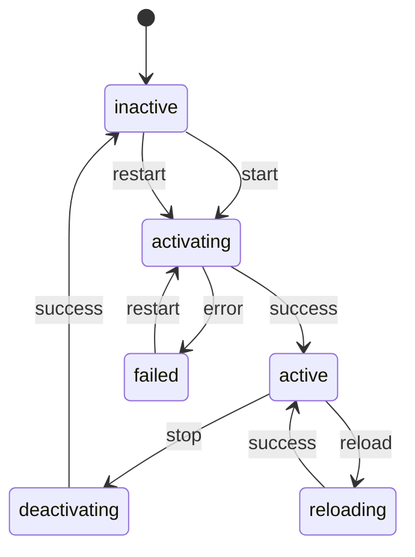
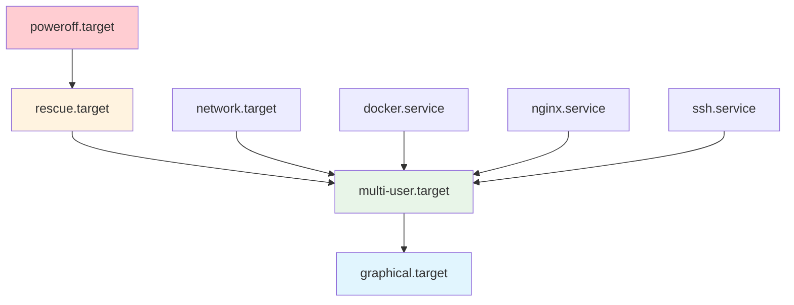

# Daemon & Service

## What is a Daemon?

A **daemon** is a background process that runs continuously on a computer system, typically starting when the system boots up and running until the system shuts down. The name comes from the Greek mythology concept of a "daemon" - a supernatural being that works behind the scenes.

### Key Characteristics of Daemons

| Characteristic | Description |
|----------------|-------------|
| **Background Process** | Runs without direct user interaction |
| **Always Running** | Starts at boot time, runs continuously |
| **No Terminal** | Doesn't have a controlling terminal |
| **System Services** | Provides services to other programs |
| **Automatic** | Works without manual intervention |

## How Daemons Work



### Daemon Lifecycle

1. **Initialization**: Daemon starts when system boots
2. **Listening**: Waits for requests or events
3. **Processing**: Handles requests when they come in
4. **Continuous Operation**: Repeats the listen-process cycle
5. **Shutdown**: Terminates when system shuts down

## Common Examples of Daemons

### System Daemons

- **`sshd`** - SSH server daemon (handles remote connections)
- **`httpd`** - HTTP server daemon (web server)
- **`mysqld`** - MySQL database daemon
- **`systemd`** - System and service manager (Linux)
- **`cron`** - Task scheduler daemon
- **`syslogd`** - System logging daemon

### How to Identify Daemons

```bash
# On Linux - daemons often end with 'd'
ps aux | grep -E "(sshd|httpd|mysqld|dockerd)"

# View all system processes
ps aux

# View running services (systemd)
systemctl list-units --type=service --state=running
```

## The Docker Daemon Specifically

The **Docker daemon** (`dockerd`) is the heart of the Docker system:

### What Docker Daemon Does



| Function | Description |
|----------|-------------|
| **API Server** | Listens for Docker API requests |
| **Image Management** | Builds, pulls, pushes, and stores images |
| **Container Management** | Creates, starts, stops, and destroys containers |
| **Network Management** | Manages container networking |
| **Volume Management** | Handles data persistence |
| **Registry Communication** | Communicates with Docker Hub and other registries |

### Docker Daemon Architecture

```bash
# Check if Docker daemon is running
systemctl status docker

# View Docker daemon logs
journalctl -u docker.service

# Start Docker daemon
sudo systemctl start docker

# Stop Docker daemon
sudo systemctl stop docker

# Restart Docker daemon
sudo systemctl restart docker
```

### Docker Client-Daemon Communication



## Why Daemons are Important

### 1. **Always Available Services**

```bash
# Web server daemon always ready to serve web pages
curl http://localhost:80  # Works anytime

# SSH daemon always ready for remote connections
ssh user@server  # Works anytime
```

### 2. **Resource Efficiency**

- Start once, serve many requests
- Share resources between multiple users/processes
- No need to restart for each request

### 3. **System Integration**

- Daemons integrate with the operating system
- Can be managed by system tools
- Start automatically on boot

### 4. **Background Processing**

```bash
# Examples of daemon-provided services:
# - Email delivery (mail daemon)
# - File sharing (NFS daemon)
# - Time synchronization (NTP daemon)
# - Log collection (syslog daemon)
```

## Daemon vs Regular Programs

| Aspect | Regular Program | Daemon |
|--------|-----------------|---------|
| **User Interaction** | Direct user control | Runs independently |
| **Lifetime** | Starts/stops with user | Runs continuously |
| **Terminal** | Has controlling terminal | No terminal |
| **Purpose** | Specific user task | System service |
| **Examples** | Text editor, calculator | Web server, database |

### Example: Web Server

```bash
# Regular program approach (manual):
# 1. User starts web server
# 2. Serves one request
# 3. User manually restarts for next request

# Daemon approach (automatic):
# 1. Web server daemon starts at boot
# 2. Continuously listens for requests
# 3. Serves multiple requests automatically
# 4. No user intervention needed
```

## Interacting with Daemons

### Through Client Programs

```bash
# Docker daemon via Docker client
docker ps                    # Client → Daemon → Response

# SSH daemon via SSH client  
ssh user@server             # Client → Daemon → Connection

# Database daemon via database client
mysql -u user -p             # Client → Daemon → Database session
```

### Through Configuration Files

```bash
# Docker daemon configuration
/etc/docker/daemon.json

# SSH daemon configuration
/etc/ssh/sshd_config

# Web server daemon configuration
/etc/nginx/nginx.conf
```

### Through System Service Management

```bash
# Control daemons with systemctl (Linux)
sudo systemctl start docker     # Start daemon
sudo systemctl stop docker      # Stop daemon
sudo systemctl restart docker   # Restart daemon
sudo systemctl enable docker    # Auto-start at boot
sudo systemctl disable docker   # Don't auto-start at boot
```

## Docker Daemon in Practice

When you run Docker commands, here's what happens:

```bash
# When you run this command:
docker run -d nginx

# Behind the scenes:
# 1. Docker client sends API request to Docker daemon
# 2. Docker daemon checks if nginx image exists locally
# 3. If not, daemon pulls from Docker registry
# 4. Daemon creates new container from image
# 5. Daemon starts the container
# 6. Daemon returns container ID to client
```

The daemon is what makes Docker "always ready" - you don't have to manually start some service each time you want to use Docker; the daemon is already running and waiting for your commands.

This is why when Docker daemon isn't running, you get errors like:

```bash
$ docker ps
Cannot connect to the Docker daemon at unix:///var/run/docker.sock. Is the docker daemon running?
```

## What is a Service in Linux?

A **service** in Linux is a program or application that runs in the background to provide specific functionality to the system or other applications. Services are the **management layer** around daemons and other background processes.

### Key Concepts

| Term | Definition |
|------|------------|
| **Service** | A managed background process that provides functionality |
| **Daemon** | The actual background process/program |
| **Service Manager** | System that controls services (like systemd) |
| **Unit File** | Configuration file that defines how a service should run |

## Service vs Daemon Relationship



**Think of it this way:**

- **Daemon** = The actual worker (the program doing the job)
- **Service** = The manager that controls the worker (start, stop, restart, monitor)

## Service Management Systems

### Historical Evolution



### Current Standard: systemd

**systemd** is the most common service manager in modern Linux distributions:

| Feature | Description |
|---------|-------------|
| **Parallel Startup** | Services start simultaneously when possible |
| **Dependency Management** | Services wait for dependencies |
| **Socket Activation** | Services start on-demand |
| **Resource Control** | CPU, memory, I/O limits |
| **Logging** | Integrated with journald |
| **Timers** | Replace cron jobs |

## Service States and Lifecycle

### Service States



| State | Description |
|-------|-------------|
| **inactive** | Service is stopped |
| **active** | Service is running |
| **activating** | Service is starting up |
| **deactivating** | Service is shutting down |
| **failed** | Service failed to start/run |
| **reloading** | Service is reloading configuration |

### Enable/Disable States

| State | Description |
|-------|-------------|
| **enabled** | Service will start automatically at boot |
| **disabled** | Service will NOT start automatically at boot |
| **static** | Service is enabled by dependency only |
| **masked** | Service is completely disabled |

## Managing Services with systemctl

### Basic Service Operations

```bash
# Check service status
systemctl status docker
systemctl status nginx
systemctl status ssh

# Start a service
sudo systemctl start docker
sudo systemctl start nginx

# Stop a service
sudo systemctl stop docker
sudo systemctl stop nginx

# Restart a service
sudo systemctl restart docker
sudo systemctl restart nginx

# Reload service configuration (without stopping)
sudo systemctl reload nginx
sudo systemctl reload ssh

# Enable service (auto-start at boot)
sudo systemctl enable docker
sudo systemctl enable nginx

# Disable service (don't auto-start at boot)
sudo systemctl disable nginx

# Check if service is enabled
systemctl is-enabled docker
systemctl is-enabled nginx

# Check if service is active (running)
systemctl is-active docker
systemctl is-active nginx
```

### Viewing Services

```bash
# List all services
systemctl list-units --type=service

# List only running services
systemctl list-units --type=service --state=running

# List only failed services
systemctl list-units --type=service --state=failed

# List all installed service files
systemctl list-unit-files --type=service

# Show service dependencies
systemctl list-dependencies docker

# Show what services depend on this service
systemctl list-dependencies --reverse docker
```

### Service Information

```bash
# Detailed service status
systemctl status docker

# View service logs
journalctl -u docker
journalctl -u docker -f          # Follow logs
journalctl -u docker --since today
journalctl -u docker --lines 50

# Show service configuration
systemctl show docker
systemctl cat docker             # Show unit file content
```

## Service Configuration Files (Unit Files)

### Unit File Locations

```bash
# System services
/etc/systemd/system/          # Local system services
/usr/lib/systemd/system/      # Package-installed services
/run/systemd/system/          # Runtime services

# User services
~/.config/systemd/user/       # User-specific services
```

### Example Service Unit File

```ini
# /etc/systemd/system/myapp.service
[Unit]
Description=My Custom Application
Documentation=https://myapp.example.com/docs
After=network.target
Requires=postgresql.service
Wants=redis.service

[Service]
Type=simple
User=myapp
Group=myapp
WorkingDirectory=/opt/myapp
ExecStart=/opt/myapp/bin/myapp --config /etc/myapp/config.yml
ExecReload=/bin/kill -HUP $MAINPID
Restart=always
RestartSec=5
Environment=NODE_ENV=production
EnvironmentFile=/etc/myapp/environment

# Resource limits
LimitNOFILE=65536
MemoryLimit=512M
CPUQuota=50%

[Install]
WantedBy=multi-user.target
```

### Unit File Sections

| Section | Purpose |
|---------|---------|
| **[Unit]** | General information and dependencies |
| **[Service]** | Service-specific configuration |
| **[Install]** | Installation information for enable/disable |

#### [Unit] Section Options

| Option | Description | Example |
|--------|-------------|---------|
| `Description` | Human-readable description | `Description=Docker Application Container Engine` |
| `After` | Start after these services | `After=network.target` |
| `Before` | Start before these services | `Before=nginx.service` |
| `Requires` | Hard dependency (fails if missing) | `Requires=postgresql.service` |
| `Wants` | Soft dependency (continues if missing) | `Wants=redis.service` |
| `Conflicts` | Cannot run with these services | `Conflicts=apache2.service` |

#### [Service] Section Options

| Option | Description | Example |
|--------|-------------|---------|
| `Type` | Service startup type | `Type=simple` |
| `ExecStart` | Command to start service | `ExecStart=/usr/bin/dockerd` |
| `ExecStop` | Command to stop service | `ExecStop=/bin/kill -TERM $MAINPID` |
| `ExecReload` | Command to reload service | `ExecReload=/bin/kill -HUP $MAINPID` |
| `Restart` | Restart policy | `Restart=always` |
| `User` | User to run service as | `User=nginx` |
| `WorkingDirectory` | Working directory | `WorkingDirectory=/var/www` |

#### Service Types

| Type | Description | Use Case |
|------|-------------|----------|
| `simple` | Main process doesn't fork | Most common |
| `forking` | Main process forks and exits | Traditional daemons |
| `oneshot` | Process exits after completing | Scripts |
| `notify` | Service notifies systemd when ready | Complex services |
| `idle` | Waits until all jobs are finished | Cleanup tasks |

## Common Linux Services

### System Services

```bash
# Network services
systemctl status NetworkManager    # Network management
systemctl status systemd-resolved  # DNS resolution
systemctl status firewalld        # Firewall

# System services
systemctl status systemd-logind    # Login management
systemctl status systemd-timesyncd # Time synchronization
systemctl status cron             # Task scheduler
systemctl status rsyslog          # System logging

# Security services
systemctl status ssh               # SSH server
systemctl status fail2ban         # Intrusion prevention
```

### Application Services

```bash
# Web servers
systemctl status nginx
systemctl status apache2
systemctl status httpd

# Databases
systemctl status mysql
systemctl status postgresql
systemctl status mongod
systemctl status redis

# Container platforms
systemctl status docker
systemctl status containerd
systemctl status podman

# Development tools
systemctl status jenkins
systemctl status gitlab-runner
```

## Creating Custom Services

### Example: Simple Python Web App Service

#### 1. Create the service file

```bash
sudo nano /etc/systemd/system/webapp.service
```

```ini
[Unit]
Description=Python Web Application
After=network.target

[Service]
Type=simple
User=webapp
Group=webapp
WorkingDirectory=/opt/webapp
ExecStart=/opt/webapp/venv/bin/python app.py
Restart=always
RestartSec=3
Environment=FLASK_ENV=production

[Install]
WantedBy=multi-user.target
```

#### 2. Create user and setup

```bash
# Create user
sudo useradd -r -s /bin/false webapp

# Set permissions
sudo chown -R webapp:webapp /opt/webapp

# Reload systemd
sudo systemctl daemon-reload

# Enable and start service
sudo systemctl enable webapp
sudo systemctl start webapp

# Check status
systemctl status webapp
```

### Example: Docker Service Integration

```ini
# /etc/systemd/system/myapp-container.service
[Unit]
Description=My App Container
Requires=docker.service
After=docker.service

[Service]
Type=oneshot
RemainAfterExit=yes
ExecStart=/usr/bin/docker run -d --name myapp -p 8080:80 myapp:latest
ExecStop=/usr/bin/docker stop myapp
ExecStopPost=/usr/bin/docker rm myapp

[Install]
WantedBy=multi-user.target
```

## Service Dependencies and Targets

### Understanding Targets



| Target | Description | Similar to Runlevel |
|--------|-------------|-------------------|
| `poweroff.target` | System shutdown | 0 |
| `rescue.target` | Single-user mode | 1 |
| `multi-user.target` | Multi-user, no GUI | 3 |
| `graphical.target` | Multi-user with GUI | 5 |
| `reboot.target` | System reboot | 6 |

```bash
# View current target
systemctl get-default

# Change default target
sudo systemctl set-default multi-user.target

# Switch to target immediately
sudo systemctl isolate rescue.target

# List services in target
systemctl list-dependencies multi-user.target
```

## Service Monitoring and Troubleshooting

### Monitoring Services

```bash
# Real-time service status
watch systemctl status docker

# Monitor service logs in real-time
journalctl -u nginx -f

# Check service performance
systemctl show docker --property=CPUUsageNSec
systemctl show docker --property=MemoryCurrent

# List all failed services
systemctl --failed

# Analyze boot time
systemd-analyze
systemd-analyze blame
systemd-analyze critical-chain
```

### Troubleshooting Services

```bash
# Check why service failed
systemctl status myservice
journalctl -u myservice --no-pager

# Validate unit file syntax
systemd-analyze verify /etc/systemd/system/myservice.service

# Test service configuration
sudo systemctl daemon-reload
sudo systemctl restart myservice

# Debug service startup
sudo systemctl start myservice
journalctl -u myservice -f
```

### Common Issues and Solutions

| Issue | Cause | Solution |
|-------|-------|----------|
| Service won't start | Missing dependencies | Check `systemctl status` and logs |
| Service fails randomly | Resource limits | Check memory/CPU usage |
| Service starts but stops | Permission issues | Check user/file permissions |
| Dependencies not met | Wrong order | Fix `After=` and `Requires=` |

## Service Security Best Practices

### 1. Run with Minimal Privileges

```ini
[Service]
User=serviceuser
Group=servicegroup
NoNewPrivileges=yes
PrivateTmp=yes
ProtectSystem=strict
ProtectHome=yes
```

### 2. Resource Limits

```ini
[Service]
MemoryLimit=512M
CPUQuota=50%
TasksMax=100
LimitNOFILE=1024
```

### 3. Security Features

```ini
[Service]
CapabilityBoundingSet=CAP_NET_BIND_SERVICE
AmbientCapabilities=CAP_NET_BIND_SERVICE
PrivateDevices=yes
ProtectKernelTunables=yes
ProtectControlGroups=yes
```

## Summary

**Services in Linux are:**

- **Managed background processes** that provide system functionality
- **Controlled by service managers** like systemd
- **Configured through unit files** that define behavior
- **Essential for system operation** (networking, security, applications)

**Key Commands to Remember:**

```bash
# Essential service management
systemctl status <service>     # Check status
sudo systemctl start <service> # Start service  
sudo systemctl enable <service> # Auto-start at boot
journalctl -u <service>        # View logs
systemctl list-units --type=service # List all services
```

Understanding services is crucial for Linux administration, especially when working with containerized applications like Docker, web servers, databases, and custom applications!
