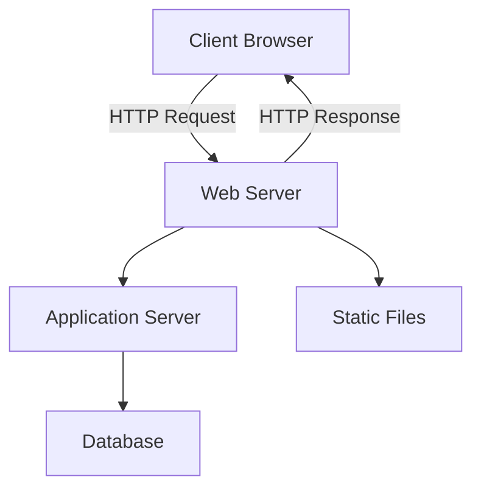
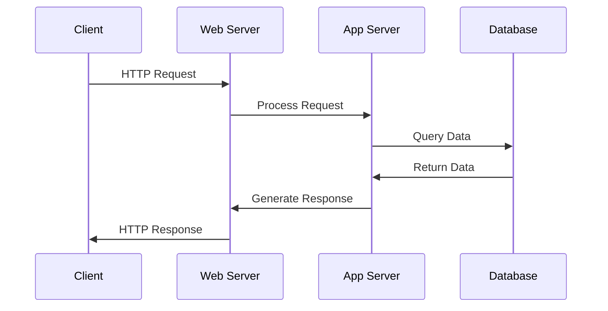
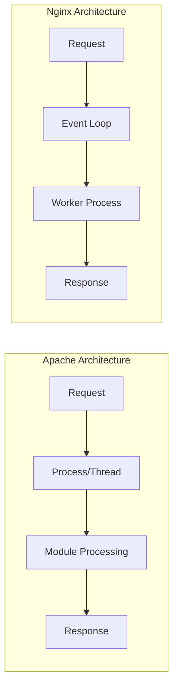
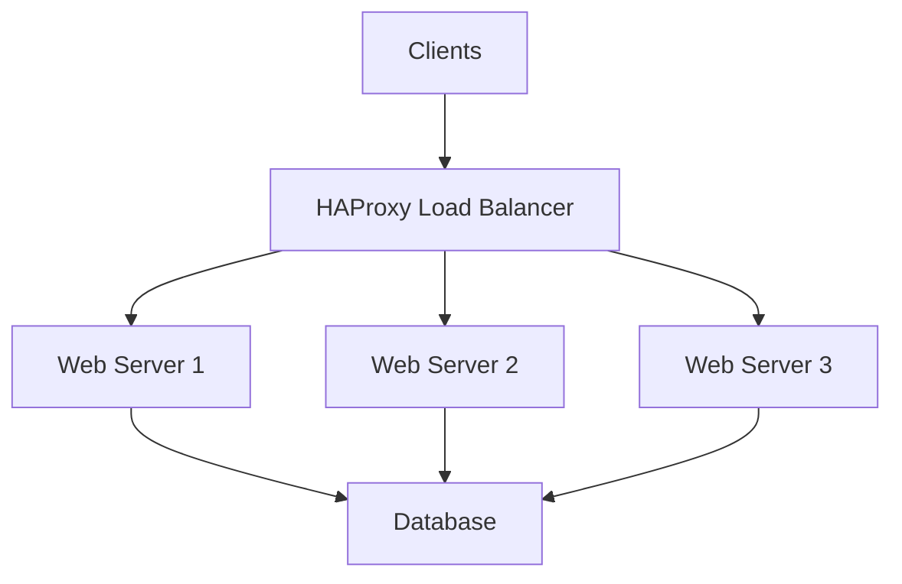
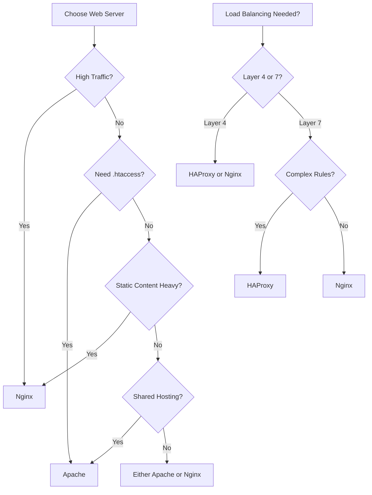
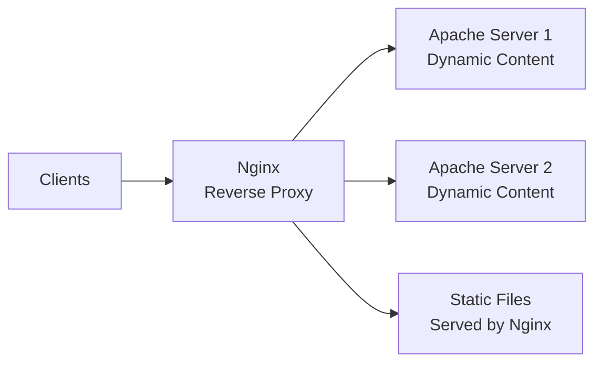
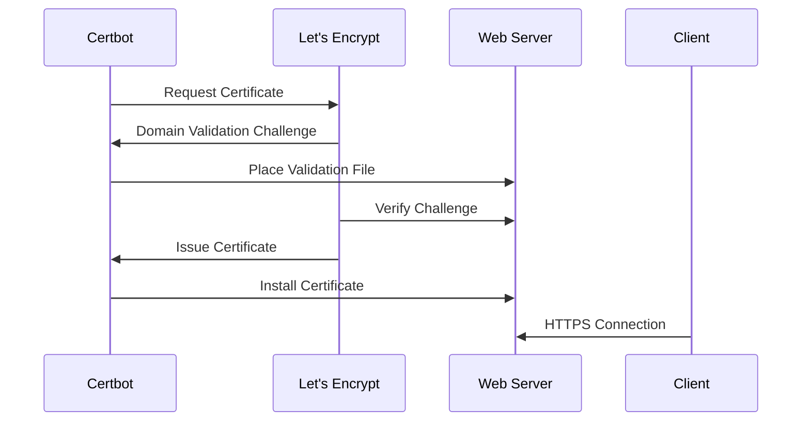
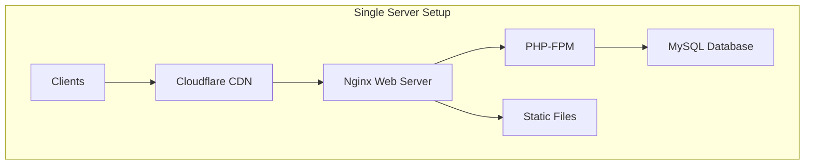
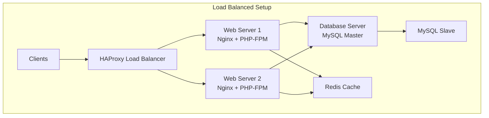
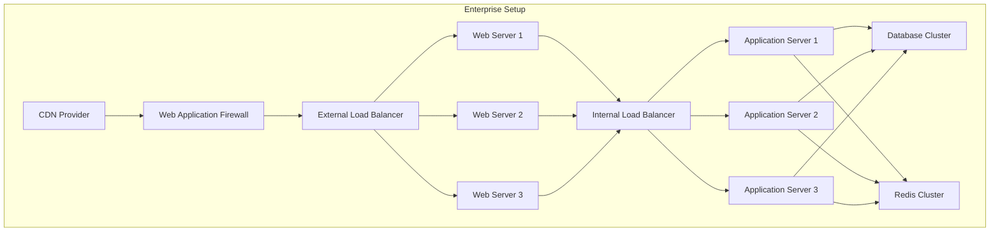

# Complete Guide to Server Basics and Configuration

## Table of Contents

1. [Server Architecture Basics](#server-architecture-basics)
2. [Web Server Fundamentals](#web-server-fundamentals)
3. [Apache vs Nginx Configuration](#apache-vs-nginx-configuration)
4. [HAProxy Load Balancer Setup](#haproxy-load-balancer-setup)
5. [When to Use Which Technology](#when-to-use-which-technology)
6. [SSL/TLS with Certbot Configuration](#ssltls-with-certbot-configuration)
7. [Real-World Architecture Examples](#real-world-architecture-examples)
8. [Troubleshooting and Best Practices](#troubleshooting-and-best-practices)
9. [Security Considerations](#security-considerations)

---

## Server Architecture Basics

### What is a Web Server?

A web server is software that serves web content to clients (browsers) over the internet. It handles HTTP/HTTPS requests and responds with the requested resources like HTML pages, images, or API data.

### Basic Server Components



**Key Components:**
- **Web Server**: Handles HTTP requests (Apache, Nginx)
- **Application Server**: Processes dynamic content (PHP-FPM, Node.js, Python)
- **Database**: Stores application data (MySQL, PostgreSQL, MongoDB)
- **Load Balancer**: Distributes traffic across servers (HAProxy, Nginx)

### Server Architecture Evolution

| Architecture Type | Description | Use Case |
|------------------|-------------|----------|
| **Single Server** | Everything on one machine | Small websites, development |
| **Multi-tier** | Separate web, app, database layers | Medium applications |
| **Load Balanced** | Multiple servers behind load balancer | High-traffic applications |
| **Microservices** | Distributed services architecture | Enterprise applications |

---

## Web Server Fundamentals

### How Web Servers Work



### Request Processing Flow

1. **Connection Establishment**: Client connects to server on port 80/443
2. **Request Parsing**: Server parses HTTP headers and method
3. **Resource Location**: Server locates requested resource
4. **Content Generation**: Static files served directly, dynamic content processed
5. **Response Generation**: HTTP response with status code and content
6. **Connection Management**: Keep-alive or close connection

### Server Performance Factors

**Connection Handling Models:**
- **Process-based**: Each request gets a new process (Apache prefork)
- **Thread-based**: Multiple threads share processes (Apache worker)
- **Event-driven**: Single thread handles multiple connections (Nginx, Apache event)

---

## Apache vs Nginx Configuration

### Architecture Comparison



### Apache HTTP Server

**Strengths:**
- Extensive module ecosystem with dynamic loading capability
- Directory-level configuration via .htaccess files
- Mature, well-documented, large community
- Built-in support for dynamic content processing

**Weaknesses:**
- Higher memory consumption due to process-based architecture
- Performance impact from .htaccess file processing
- Less efficient for static content delivery

#### Apache Configuration Example

```apache
# /etc/apache2/sites-available/example.com.conf
<VirtualHost *:80>
    ServerName example.com
    DocumentRoot /var/www/html/example.com
    
    # Directory permissions
    <Directory /var/www/html/example.com>
        Options Indexes FollowSymLinks
        AllowOverride All
        Require all granted
    </Directory>
    
    # PHP processing
    <FilesMatch \.php$>
        SetHandler application/x-httpd-php
    </FilesMatch>
    
    # Logging
    ErrorLog ${APACHE_LOG_DIR}/example.com_error.log
    CustomLog ${APACHE_LOG_DIR}/example.com_access.log combined
</VirtualHost>

# Enable SSL
<VirtualHost *:443>
    ServerName example.com
    DocumentRoot /var/www/html/example.com
    
    SSLEngine on
    SSLCertificateFile /path/to/certificate.crt
    SSLCertificateKeyFile /path/to/private.key
    
    # Security headers
    Header always set Strict-Transport-Security "max-age=31536000"
    Header always set X-Content-Type-Options nosniff
    Header always set X-Frame-Options DENY
</VirtualHost>
```

### Nginx

**Strengths:**
- Event-driven architecture handles thousands of concurrent connections efficiently
- Superior performance for serving static content
- Lower resource consumption
- Excellent reverse proxy and load balancing capabilities

**Weaknesses:**
- No dynamic module loading at runtime
- No directory-level configuration (.htaccess equivalent)
- Requires external processors for dynamic content

#### Complete Nginx Configuration Guide

##### Main Configuration Structure

```nginx
# /etc/nginx/nginx.conf - Main configuration file
user nginx;
worker_processes auto;  # Auto-detect CPU cores
error_log /var/log/nginx/error.log warn;
pid /var/run/nginx.pid;

# Events block - Connection processing
events {
    # Maximum number of simultaneous connections per worker process
    worker_connections 1024;
    
    # Connection processing method (Linux: epoll, FreeBSD: kqueue)
    use epoll;
    
    # Accept multiple connections at once
    multi_accept on;
    
    # Worker process accepts new connections in turn
    accept_mutex off;
}

# HTTP block - Main HTTP configuration
http {
    # MIME types
    include /etc/nginx/mime.types;
    default_type application/octet-stream;
    
    # Logging format
    log_format main '$remote_addr - $remote_user [$time_local] "$request" '
                   '$status $body_bytes_sent "$http_referer" '
                   '"$http_user_agent" "$http_x_forwarded_for" '
                   'rt=$request_time uct="$upstream_connect_time" '
                   'uht="$upstream_header_time" urt="$upstream_response_time"';
    
    # Performance and optimization settings
    sendfile on;                    # Efficient file transfer
    tcp_nopush on;                 # Send headers in one packet
    tcp_nodelay on;                # Don't delay sending small packets
    keepalive_timeout 65;          # Keep connections alive for 65 seconds
    keepalive_requests 100;        # Max requests per keep-alive connection
    types_hash_max_size 2048;      # Hash table size for MIME types
    
    # Server tokens (security)
    server_tokens off;             # Hide Nginx version in headers
    
    # Client request limits
    client_max_body_size 100M;     # Maximum upload size
    client_body_buffer_size 128k;  # Buffer size for request body
    client_header_buffer_size 1k;  # Buffer size for request headers
    large_client_header_buffers 4 4k; # Large header buffer settings
    client_body_timeout 12;        # Timeout for reading request body
    client_header_timeout 12;      # Timeout for reading request headers
    
    # Gzip compression
    gzip on;
    gzip_vary on;
    gzip_proxied any;
    gzip_comp_level 6;
    gzip_types
        text/plain
        text/css
        text/xml
        text/javascript
        application/json
        application/javascript
        application/xml+rss
        application/atom+xml
        image/svg+xml;
    gzip_min_length 1000;
    
    # Rate limiting zones
    limit_req_zone $binary_remote_addr zone=login:10m rate=1r/s;
    limit_req_zone $binary_remote_addr zone=api:10m rate=10r/s;
    limit_conn_zone $binary_remote_addr zone=addr:10m;
    
    # Include additional configurations
    include /etc/nginx/conf.d/*.conf;
    include /etc/nginx/sites-enabled/*;
}
```

##### Detailed Server Block Configuration

```nginx
# /etc/nginx/sites-available/example.com
server {
    # Listen directives
    listen 80;                          # IPv4 port 80
    listen [::]:80;                     # IPv6 port 80
    listen 443 ssl http2;               # HTTPS with HTTP/2
    listen [::]:443 ssl http2;          # IPv6 HTTPS with HTTP/2
    
    # Server identification
    server_name example.com www.example.com *.example.com;
    
    # Document root and index files
    root /var/www/html/example.com;
    index index.php index.html index.htm;
    
    # Character set
    charset utf-8;
    
    # Access and error logs with custom format
    access_log /var/log/nginx/example.com.access.log main buffer=16k flush=2m;
    error_log /var/log/nginx/example.com.error.log warn;
    
    # SSL Configuration (detailed)
    ssl_certificate /etc/letsencrypt/live/example.com/fullchain.pem;
    ssl_certificate_key /etc/letsencrypt/live/example.com/privkey.pem;
    ssl_trusted_certificate /etc/letsencrypt/live/example.com/chain.pem;
    
    # SSL protocols and ciphers
    ssl_protocols TLSv1.2 TLSv1.3;
    ssl_ciphers ECDHE-RSA-AES256-GCM-SHA512:DHE-RSA-AES256-GCM-SHA512:ECDHE-RSA-AES256-GCM-SHA384;
    ssl_prefer_server_ciphers off;
    
    # SSL performance settings
    ssl_session_cache shared:SSL:1m;    # Shared SSL session cache
    ssl_session_timeout 10m;            # SSL session timeout
    ssl_session_tickets off;            # Disable session tickets
    
    # OCSP stapling
    ssl_stapling on;
    ssl_stapling_verify on;
    resolver 8.8.8.8 8.8.4.4 valid=300s;
    resolver_timeout 5s;
    
    # DH parameters for perfect forward secrecy
    ssl_dhparam /etc/ssl/certs/dhparam.pem;
    
    # Security headers
    add_header Strict-Transport-Security "max-age=63072000; includeSubDomains; preload" always;
    add_header X-Content-Type-Options "nosniff" always;
    add_header X-Frame-Options "SAMEORIGIN" always;
    add_header X-XSS-Protection "1; mode=block" always;
    add_header Referrer-Policy "no-referrer-when-downgrade" always;
    add_header Content-Security-Policy "default-src 'self' http: https: data: blob: 'unsafe-inline'" always;
    
    # Rate limiting
    limit_req zone=api burst=20 nodelay;
    limit_conn addr 10;
    
    # Main location block
    location / {
        # Try files in order: exact file, directory, then 404
        try_files $uri $uri/ /index.php?$query_string;
        
        # Security: prevent access to hidden files
        location ~ /\. {
            deny all;
            access_log off;
            log_not_found off;
        }
    }
    
    # PHP processing with detailed FastCGI configuration
    location ~ \.php$ {
        # Security check: ensure file exists
        try_files $uri =404;
        
        # FastCGI configuration
        fastcgi_split_path_info ^(.+\.php)(/.+)$;
        fastcgi_pass unix:/var/run/php/php8.1-fpm.sock;  # PHP-FPM socket
        fastcgi_index index.php;
        
        # FastCGI parameters
        fastcgi_param SCRIPT_FILENAME $document_root$fastcgi_script_name;
        fastcgi_param QUERY_STRING $query_string;
        fastcgi_param REQUEST_METHOD $request_method;
        fastcgi_param CONTENT_TYPE $content_type;
        fastcgi_param CONTENT_LENGTH $content_length;
        fastcgi_param SCRIPT_NAME $fastcgi_script_name;
        fastcgi_param REQUEST_URI $request_uri;
        fastcgi_param DOCUMENT_URI $document_uri;
        fastcgi_param DOCUMENT_ROOT $document_root;
        fastcgi_param SERVER_PROTOCOL $server_protocol;
        fastcgi_param REQUEST_SCHEME $scheme;
        fastcgi_param HTTPS $https if_not_empty;
        fastcgi_param GATEWAY_INTERFACE CGI/1.1;
        fastcgi_param SERVER_SOFTWARE nginx/$nginx_version;
        fastcgi_param REMOTE_ADDR $remote_addr;
        fastcgi_param REMOTE_PORT $remote_port;
        fastcgi_param SERVER_ADDR $server_addr;
        fastcgi_param SERVER_PORT $server_port;
        fastcgi_param SERVER_NAME $server_name;
        
        # FastCGI timeouts and buffers
        fastcgi_connect_timeout 60s;
        fastcgi_send_timeout 60s;
        fastcgi_read_timeout 60s;
        fastcgi_buffer_size 128k;
        fastcgi_buffers 4 256k;
        fastcgi_busy_buffers_size 256k;
        fastcgi_temp_file_write_size 256k;
        
        # FastCGI caching (optional)
        fastcgi_cache_bypass $skip_cache;
        fastcgi_no_cache $skip_cache;
        fastcgi_cache WORDPRESS;
        fastcgi_cache_valid 200 60m;
    }
    
    # Static file optimization with detailed caching
    location ~* \.(js|css|png|jpg|jpeg|gif|ico|svg|woff|woff2|ttf|eot)$ {
        # Set expiration time
        expires 1y;
        add_header Cache-Control "public, immutable";
        add_header Vary "Accept-Encoding";
        
        # Access log not needed for static files
        access_log off;
        
        # Optimize file serving
        sendfile on;
        tcp_nopush on;
        tcp_nodelay on;
        
        # Gzip static files
        gzip_static on;
    }
    
    # API endpoint with specific rate limiting
    location ^~ /api/ {
        # Apply API rate limiting
        limit_req zone=api burst=10 nodelay;
        
        # Proxy to backend API server
        proxy_pass http://api_backend;
        proxy_set_header Host $host;
        proxy_set_header X-Real-IP $remote_addr;
        proxy_set_header X-Forwarded-For $proxy_add_x_forwarded_for;
        proxy_set_header X-Forwarded-Proto $scheme;
        
        # Proxy timeouts
        proxy_connect_timeout 30s;
        proxy_send_timeout 30s;
        proxy_read_timeout 30s;
        
        # Proxy buffering
        proxy_buffering on;
        proxy_buffer_size 128k;
        proxy_buffers 4 256k;
        proxy_busy_buffers_size 256k;
    }
    
    # WordPress specific configurations
    location = /favicon.ico {
        log_not_found off;
        access_log off;
    }
    
    location = /robots.txt {
        allow all;
        log_not_found off;
        access_log off;
    }
    
    # Deny access to sensitive files
    location ~* \.(htaccess|htpasswd|ini|log|sh|sql|conf)$ {
        deny all;
    }
    
    # WordPress security
    location ~* /(?:uploads|files)/.*\.php$ {
        deny all;
    }
}

# HTTP to HTTPS redirect server block
server {
    listen 80;
    listen [::]:80;
    server_name example.com www.example.com;
    
    # Redirect all HTTP requests to HTTPS
    return 301 https://$server_name$request_uri;
}
```

##### Advanced Nginx Configuration Parameters

##### Performance Tuning Parameters

```nginx
# /etc/nginx/conf.d/performance.conf
# Worker process optimization
worker_processes auto;           # Auto-detect CPU cores (recommended)
worker_cpu_affinity auto;       # Bind workers to CPU cores
worker_priority -5;              # Process priority (-20 to 20, lower = higher priority)
worker_rlimit_nofile 65535;     # File descriptor limit per worker

# Connection handling
events {
    worker_connections 4096;     # Max connections per worker (adjust based on RAM)
    use epoll;                   # Linux-specific efficient connection method
    multi_accept on;            # Accept multiple connections simultaneously
    accept_mutex off;           # Disable accept mutex for better performance
}

# HTTP performance settings
http {
    # Sendfile and TCP optimization
    sendfile on;
    sendfile_max_chunk 1m;      # Limit sendfile chunk size
    tcp_nopush on;              # Send headers in one packet
    tcp_nodelay on;             # Don't delay small packets
    
    # Keep-alive settings
    keepalive_timeout 65;       # Keep connections alive
    keepalive_requests 1000;    # Requests per keep-alive connection
    
    # Hash table sizes
    server_names_hash_bucket_size 128;
    server_names_hash_max_size 2048;
    types_hash_max_size 4096;
    variables_hash_max_size 2048;
    
    # Open file cache
    open_file_cache max=10000 inactive=60s;
    open_file_cache_valid 120s;
    open_file_cache_min_uses 2;
    open_file_cache_errors on;
    
    # Buffer sizes
    client_body_buffer_size 256k;
    client_header_buffer_size 64k;
    large_client_header_buffers 4 64k;
    output_buffers 2 512k;
    postpone_output 1460;
}
```

##### Security Configuration

```nginx
# /etc/nginx/conf.d/security.conf
http {
    # Hide server information
    server_tokens off;
    more_clear_headers Server;
    
    # Request limits
    client_max_body_size 50M;
    client_body_timeout 30s;
    client_header_timeout 30s;
    send_timeout 30s;
    
    # Rate limiting zones
    limit_req_zone $binary_remote_addr zone=login:10m rate=1r/s;
    limit_req_zone $binary_remote_addr zone=api:10m rate=10r/s;
    limit_req_zone $binary_remote_addr zone=search:10m rate=5r/s;
    limit_conn_zone $binary_remote_addr zone=addr:10m;
    
    # Security headers map
    map $sent_http_content_type $nosniff_header {
        ~^text/ nosniff;
    }
    
    # Block common attacks
    map $request_uri $blocked {
        ~*/(wp-admin|wp-login|xmlrpc) 1;
        ~*/\.(env|git|svn) 1;
        default 0;
    }
    
    # Geographic blocking (example)
    geo $blocked_country {
        default 0;
        # Block specific countries if needed
        # 1.2.3.0/24 1;
    }
}

server {
    # Block unwanted requests
    if ($blocked = 1) {
        return 444;  # Close connection without response
    }
    
    # Security headers
    add_header X-Frame-Options "SAMEORIGIN" always;
    add_header X-Content-Type-Options $nosniff_header always;
    add_header X-XSS-Protection "1; mode=block" always;
    add_header Strict-Transport-Security "max-age=31536000; includeSubDomains" always;
    add_header Referrer-Policy "strict-origin-when-cross-origin" always;
    
    # Content Security Policy
    add_header Content-Security-Policy "
        default-src 'self';
        script-src 'self' 'unsafe-inline' 'unsafe-eval' https://www.google-analytics.com;
        style-src 'self' 'unsafe-inline' https://fonts.googleapis.com;
        font-src 'self' https://fonts.gstatic.com;
        img-src 'self' data: https:;
        connect-src 'self' https://api.example.com;
    " always;
    
    # Rate limiting applications
    location /login {
        limit_req zone=login burst=3 nodelay;
        # ... other config
    }
    
    location /api/ {
        limit_req zone=api burst=20 nodelay;
        limit_conn addr 5;
        # ... other config
    }
}
```

##### Caching Configuration

```nginx
# /etc/nginx/conf.d/caching.conf
http {
    # FastCGI cache path
    fastcgi_cache_path /var/cache/nginx/fastcgi
        levels=1:2
        keys_zone=WORDPRESS:100m
        inactive=60m
        max_size=1g
        use_temp_path=off;
    
    # Proxy cache path
    proxy_cache_path /var/cache/nginx/proxy
        levels=1:2
        keys_zone=PROXY:100m
        inactive=60m
        max_size=1g
        use_temp_path=off;
    
    # Cache bypass conditions
    map $request_uri $skip_cache {
        default 0;
        ~*/wp-admin/ 1;
        ~*/wp-login.php 1;
        ~*/wp-content/uploads/ 1;
    }
    
    map $http_cookie $skip_cache {
        default 0;
        ~*wordpress_logged_in 1;
        ~*comment_author 1;
    }
}

server {
    # FastCGI caching for PHP
    location ~ \.php$ {
        fastcgi_cache WORDPRESS;
        fastcgi_cache_valid 200 301 302 60m;
        fastcgi_cache_valid 404 10m;
        fastcgi_cache_bypass $skip_cache;
        fastcgi_no_cache $skip_cache;
        
        # Cache headers
        add_header X-Cache-Status $upstream_cache_status;
        
        # ... FastCGI config
    }
    
    # Proxy caching
    location /api/ {
        proxy_cache PROXY;
        proxy_cache_valid 200 10m;
        proxy_cache_valid 404 1m;
        proxy_cache_use_stale error timeout updating http_500 http_502 http_503 http_504;
        proxy_cache_lock on;
        
        # Cache headers
        add_header X-Proxy-Cache $upstream_cache_status;
        
        # ... Proxy config
    }
}
```

##### Load Balancing with Nginx

```nginx
# /etc/nginx/conf.d/upstream.conf
upstream backend_servers {
    # Load balancing method
    least_conn;  # Options: round_robin (default), least_conn, ip_hash, hash
    
    # Backend servers
    server 192.168.1.10:80 weight=3 max_fails=3 fail_timeout=30s;
    server 192.168.1.11:80 weight=2 max_fails=3 fail_timeout=30s;
    server 192.168.1.12:80 weight=1 max_fails=3 fail_timeout=30s backup;
    
    # Keep-alive connections to upstream
    keepalive 32;
}

upstream api_servers {
    # Consistent hashing for session persistence
    hash $remote_addr consistent;
    
    server 192.168.1.20:8080 max_fails=2 fail_timeout=20s;
    server 192.168.1.21:8080 max_fails=2 fail_timeout=20s;
    
    # Health check (requires nginx-plus or custom module)
    # health_check interval=5s fails=3 passes=2;
}

server {
    location / {
        proxy_pass http://backend_servers;
        
        # Proxy headers
        proxy_set_header Host $host;
        proxy_set_header X-Real-IP $remote_addr;
        proxy_set_header X-Forwarded-For $proxy_add_x_forwarded_for;
        proxy_set_header X-Forwarded-Proto $scheme;
        
        # Proxy timeouts
        proxy_connect_timeout 30s;
        proxy_send_timeout 30s;
        proxy_read_timeout 30s;
        
        # Proxy buffering
        proxy_buffering on;
        proxy_buffer_size 128k;
        proxy_buffers 8 128k;
        proxy_busy_buffers_size 256k;
        proxy_temp_file_write_size 256k;
        
        # Keep-alive to upstream
        proxy_http_version 1.1;
        proxy_set_header Connection "";
    }
}
```

##### Nginx Parameter Reference Table

| Parameter | Description | Default | Recommended |
|-----------|-------------|---------|-------------|
| `worker_processes` | Number of worker processes | 1 | auto |
| `worker_connections` | Max connections per worker | 512 | 1024-4096 |
| `keepalive_timeout` | Keep-alive connection timeout | 75s | 65s |
| `client_max_body_size` | Maximum request body size | 1m | 50M-100M |
| `client_body_timeout` | Request body read timeout | 60s | 30s |
| `client_header_timeout` | Request header read timeout | 60s | 30s |
| `send_timeout` | Response send timeout | 60s | 30s |
| `sendfile` | Use sendfile() syscall | off | on |
| `tcp_nopush` | Send headers in one packet | off | on |
| `tcp_nodelay` | Disable Nagle's algorithm | on | on |
| `gzip` | Enable gzip compression | off | on |
##### Advanced Nginx Modules and Features

##### HTTP/2 and HTTP/3 Configuration

```nginx
# HTTP/2 configuration
server {
    listen 443 ssl http2;
    listen [::]:443 ssl http2;
    
    # HTTP/2 specific settings
    http2_push_preload on;           # Enable server push based on preload headers
    http2_max_field_size 16k;        # Maximum size of HPACK-compressed request header field
    http2_max_header_size 32k;       # Maximum size of entire request header list
    http2_max_requests 1000;         # Maximum number of requests in HTTP/2 connection
    
    # Server push example
    location = /index.html {
        http2_push /css/main.css;
        http2_push /js/app.js;
    }
}

# HTTP/3 (QUIC) configuration (experimental)
server {
    listen 443 quic reuseport;
    listen 443 ssl http2;
    
    ssl_protocols TLSv1.3;
    ssl_early_data on;
    
    # Add Alt-Svc header to advertise HTTP/3
    add_header Alt-Svc 'h3=":443"; ma=86400';
}
```

##### Real-time Monitoring and Status

```nginx
# /etc/nginx/conf.d/status.conf
server {
    listen 8080;
    server_name localhost;
    
    # Basic status page
    location /nginx_status {
        stub_status on;
        access_log off;
        allow 127.0.0.1;
        allow 192.168.1.0/24;
        deny all;
    }
    
    # Extended status with additional metrics
    location /status {
        vhost_traffic_status_display;
        vhost_traffic_status_display_format html;
        access_log off;
        allow 127.0.0.1;
        deny all;
    }
    
    # PHP-FPM status
    location ~ ^/(fpm-status|fpm-ping)$ {
        fastcgi_pass unix:/var/run/php/php8.1-fpm.sock;
        fastcgi_param SCRIPT_FILENAME $document_root$fastcgi_script_name;
        include fastcgi_params;
        allow 127.0.0.1;
        deny all;
    }
}
```

##### WebSocket Configuration

```nginx
# WebSocket proxy configuration
upstream websocket {
    server 127.0.0.1:3000;
    server 127.0.0.1:3001;
}

server {
    location /ws/ {
        proxy_pass http://websocket;
        
        # WebSocket specific headers
        proxy_http_version 1.1;
        proxy_set_header Upgrade $http_upgrade;
        proxy_set_header Connection "upgrade";
        proxy_set_header Host $host;
        proxy_set_header X-Real-IP $remote_addr;
        proxy_set_header X-Forwarded-For $proxy_add_x_forwarded_for;
        
        # WebSocket timeouts
        proxy_connect_timeout 7d;
        proxy_send_timeout 7d;
        proxy_read_timeout 7d;
    }
}
```

##### Custom Log Formats and Analysis

```nginx
# Custom log formats for different purposes
http {
    # Detailed log format with timing information
    log_format detailed '$remote_addr - $remote_user [$time_local] '
                       '"$request" $status $body_bytes_sent '
                       '"$http_referer" "$http_user_agent" '
                       '$request_time $upstream_response_time '
                       '$upstream_connect_time $upstream_header_time';
    
    # JSON log format for structured logging
    log_format json_combined escape=json
        '{'
            '"time_local":"$time_local",'
            '"remote_addr":"$remote_addr",'
            '"remote_user":"$remote_user",'
            '"request":"$request",'
            '"status": "$status",'
            '"body_bytes_sent":"$body_bytes_sent",'
            '"request_time":"$request_time",'
            '"http_referrer":"$http_referer",'
            '"http_user_agent":"$http_user_agent",'
            '"upstream_addr":"$upstream_addr",'
            '"upstream_response_time":"$upstream_response_time",'
            '"upstream_connect_time":"$upstream_connect_time",'
            '"upstream_header_time":"$upstream_header_time"'
        '}';
    
    # Security-focused log format
    log_format security '$remote_addr - $remote_user [$time_local] '
                        '"$request" $status $body_bytes_sent '
                        '"$http_referer" "$http_user_agent" '
                        '"$http_x_forwarded_for" $ssl_protocol $ssl_cipher';
}

server {
    # Use different log formats for different locations
    access_log /var/log/nginx/access.log detailed;
    error_log /var/log/nginx/error.log warn;
    
    location /api/ {
        access_log /var/log/nginx/api.log json_combined;
    }
    
    location /admin/ {
        access_log /var/log/nginx/security.log security;
    }
}
```

##### Advanced Rewrite Rules

```nginx
server {
    # Complex rewrite rules with conditions
    
    # Redirect old URLs to new structure
    rewrite ^/old-category/(.*)$ /new-category/$1 permanent;
    
    # SEO-friendly URLs
    location / {
        try_files $uri $uri/ @rewrite;
    }
    
    location @rewrite {
        rewrite ^/products/([^/]+)/([^/]+)/?$ /product.php?category=$1&item=$2 last;
        rewrite ^/category/([^/]+)/?$ /category.php?name=$1 last;
        rewrite ^/user/([^/]+)/?$ /profile.php?username=$1 last;
    }
    
    # Conditional redirects based on user agent
    set $mobile_rewrite do_not_perform;
    
    if ($http_user_agent ~* "(android|bb\d+|meego).+mobile|avantgo|bada/") {
        set $mobile_rewrite perform;
    }
    
    if ($mobile_rewrite = perform) {
        rewrite ^ https://m.example.com$request_uri redirect;
    }
    
    # Geographic redirects
    location / {
        if ($geoip_country_code = "GB") {
            rewrite ^(.*)$ https://uk.example.com$1 redirect;
        }
        if ($geoip_country_code = "DE") {
            rewrite ^(.*)$ https://de.example.com$1 redirect;
        }
    }
}
```

##### Nginx Configuration Testing and Debugging

```bash
# Configuration validation commands

# Test configuration syntax
sudo nginx -t

# Test configuration and show parsed config
sudo nginx -T

# Test specific configuration file
sudo nginx -t -c /path/to/nginx.conf

# Show configuration with comments
sudo nginx -T | grep -v '#' | grep -v '^
```

### Performance Comparison

| Metric | Apache | Nginx |
|--------|--------|-------|
| **Static Content** | Good | Excellent (faster caching) |
| **Dynamic Content** | Excellent (built-in) | Good (via external processors) |
| **Memory Usage** | Higher | Lower |
| **Concurrent Connections** | Limited by threads | Very high (event-driven) |
| **Configuration Flexibility** | High (.htaccess) | Medium (central config only) |

---

## HAProxy Load Balancer Setup

### What is Load Balancing?

Load balancing distributes incoming network traffic across multiple servers to ensure no single server becomes overwhelmed. This improves performance, reliability, and availability.

### HAProxy Architecture



### Load Balancing Algorithms

| Algorithm | Description | Use Case |
|-----------|-------------|----------|
| **Round Robin** | Distributes requests sequentially to each server | Equal server capacity |
| **Least Connections** | Sends requests to server with fewest active connections | Varying request processing times |
| **Source IP Hash** | Routes based on client IP | Session persistence needed |
| **Weighted Round Robin** | Round robin with server weight consideration | Servers with different capacities |

### HAProxy Configuration

```bash
# /etc/haproxy/haproxy.cfg

global
    daemon
    log 127.0.0.1 local0
    chroot /var/lib/haproxy
    stats socket /run/haproxy/admin.sock mode 660 level admin
    stats timeout 30s
    user haproxy
    group haproxy
    
    # SSL settings
    ssl-default-bind-ciphers ECDHE-RSA-AES256-GCM-SHA384:ECDHE-RSA-CHACHA20-POLY1305
    ssl-default-bind-options ssl-min-ver TLSv1.2 no-tls-tickets

defaults
    mode http
    log global
    option httplog
    option dontlognull
    option redispatch
    retries 3
    timeout connect 5s
    timeout client 30s
    timeout server 30s
    timeout http-request 10s
    timeout http-keep-alive 2s
    timeout check 3s
    
    # Error pages
    errorfile 400 /etc/haproxy/errors/400.http
    errorfile 403 /etc/haproxy/errors/403.http
    errorfile 408 /etc/haproxy/errors/408.http
    errorfile 500 /etc/haproxy/errors/500.http
    errorfile 502 /etc/haproxy/errors/502.http
    errorfile 503 /etc/haproxy/errors/503.http
    errorfile 504 /etc/haproxy/errors/504.http

# Statistics interface
stats enable
stats uri /stats
stats realm HAProxy\ Statistics
stats auth admin:password123

# Frontend configuration
frontend web_frontend
    bind *:80
    bind *:443 ssl crt /etc/ssl/certs/example.com.pem
    
    # Redirect HTTP to HTTPS
    redirect scheme https code 301 if !{ ssl_fc }
    
    # Security headers
    http-response set-header Strict-Transport-Security "max-age=31536000"
    http-response set-header X-Content-Type-Options "nosniff"
    http-response set-header X-Frame-Options "DENY"
    
    # ACL definitions
    acl is_api path_beg /api
    acl is_static path_end .css .js .png .jpg .gif .ico
    
    # Routing rules
    use_backend api_servers if is_api
    use_backend static_servers if is_static
    default_backend web_servers

# Backend configurations
backend web_servers
    balance roundrobin
    option httpchk GET /health
    http-check expect status 200
    
    # Enable session persistence
    cookie SERVERID insert indirect nocache
    
    server web1 192.168.1.10:80 check cookie web1 maxconn 100
    server web2 192.168.1.11:80 check cookie web2 maxconn 100
    server web3 192.168.1.12:80 check cookie web3 maxconn 100

backend api_servers
    balance leastconn
    option httpchk GET /api/health
    http-check expect status 200
    
    server api1 192.168.1.20:8080 check maxconn 50
    server api2 192.168.1.21:8080 check maxconn 50

backend static_servers
    balance roundrobin
    option httpchk HEAD /
    
    server static1 192.168.1.30:80 check
    server static2 192.168.1.31:80 check

# Database load balancing (TCP mode)
listen mysql_cluster
    bind *:3306
    mode tcp
    balance leastconn
    option tcpka
    option mysql-check user haproxy_check
    
    server db1 192.168.1.40:3306 check
    server db2 192.168.1.41:3306 check backup
```

### HAProxy Management Commands

```bash
# Install HAProxy
sudo apt update
sudo apt install haproxy -y

# Enable and start HAProxy
sudo systemctl enable haproxy
sudo systemctl start haproxy

# Check configuration syntax
sudo haproxy -c -f /etc/haproxy/haproxy.cfg

# Reload configuration without downtime
sudo systemctl reload haproxy

# Monitor HAProxy logs
sudo tail -f /var/log/haproxy.log

# Check status
sudo systemctl status haproxy
```

### Health Checks and Monitoring

```bash
# Custom health check endpoint (place on each backend server)
# /var/www/html/health.php
<?php
header('Content-Type: application/json');
$health = [
    'status' => 'healthy',
    'timestamp' => time(),
    'server' => gethostname(),
    'load' => sys_getloadavg()[0]
];
echo json_encode($health);
?>
```

---

## When to Use Which Technology

### Decision Matrix



### Use Case Scenarios

#### Choose Apache When:

| Scenario | Reason |
|----------|---------|
| **Shared Hosting** | .htaccess files allow directory-level configuration without server restart |
| **Legacy Applications** | Built-in support for various scripting languages |
| **Complex Modules** | Extensive module ecosystem with easy loading |
| **Development Environment** | Easier configuration and debugging |
| **Small to Medium Sites** | Adequate performance with simpler management |

#### Choose Nginx When:

| Scenario | Reason |
|----------|---------|
| **High Traffic Sites** | Superior handling of concurrent connections |
| **Static Content Heavy** | Optimized for static file delivery |
| **Reverse Proxy/Load Balancing** | Built-in proxy capabilities |
| **Microservices** | Excellent for containerized applications |
| **Resource Constraints** | Lower memory footprint |

#### Choose HAProxy When:

| Scenario | Reason |
|----------|---------|
| **Complex Load Balancing** | Advanced ACLs and routing rules |
| **High Availability Required** | Automatic failover and health checks |
| **Multiple Protocols** | TCP and HTTP load balancing |
| **Detailed Monitoring** | Comprehensive statistics and logging |
| **Session Persistence** | Advanced session handling capabilities |

### Hybrid Architectures

**Nginx + Apache (Popular Combination):**


**Benefits:**
- Nginx handles static content and reverse proxy, Apache processes dynamic content
- Best of both worlds: performance + flexibility
- Nginx terminates SSL, Apache handles PHP/applications

---

## SSL/TLS with Certbot Configuration

### What is Let's Encrypt?

Let's Encrypt provides free SSL/TLS certificates through an automated certificate authority. Certbot is the recommended ACME client for obtaining and managing these certificates.

### SSL/TLS Certificate Lifecycle



### Certbot Installation and Usage

#### Installation Methods

```bash
# Ubuntu/Debian - APT method
sudo apt update
sudo apt install certbot python3-certbot-nginx python3-certbot-apache

# CentOS/RHEL - YUM method
sudo yum install epel-release
sudo yum install certbot python3-certbot-nginx python3-certbot-apache

# Alternative: Snap method (recommended)
sudo snap install core; sudo snap refresh core
sudo snap install --classic certbot
sudo ln -s /snap/bin/certbot /usr/bin/certbot
```

#### Certificate Generation Methods

**1. Standalone Method (No Web Server Running):**
```bash
# Stop web server first
sudo systemctl stop apache2  # or nginx

# Generate certificate
sudo certbot certonly --standalone \
  -d example.com \
  -d www.example.com \
  --email admin@example.com \
  --agree-tos

# Start web server
sudo systemctl start apache2  # or nginx
```

**2. Nginx Integration (Automatic Configuration):**
```bash
sudo certbot --nginx \
  -d example.com \
  -d www.example.com \
  --email admin@example.com \
  --agree-tos \
  --redirect
```

**3. Apache Integration (Automatic Configuration):**
```bash
sudo certbot --apache \
  -d example.com \
  -d www.example.com \
  --email admin@example.com \
  --agree-tos \
  --redirect
```

**4. Webroot Method (Existing Web Server):**
```bash
sudo certbot certonly --webroot \
  -w /var/www/html/example.com \
  -d example.com \
  -d www.example.com \
  --email admin@example.com \
  --agree-tos
```

**5. DNS Challenge (For Wildcards):**
```bash
sudo certbot certonly --manual \
  --preferred-challenges=dns \
  -d example.com \
  -d "*.example.com" \
  --email admin@example.com \
  --agree-tos
```

### Certificate Management

#### Certificate Renewal

Let's Encrypt certificates expire after 90 days. Certbot automatically sets up renewal checking twice daily.

```bash
# Test renewal
sudo certbot renew --dry-run

# Force renewal
sudo certbot renew --force-renewal

# Renew specific certificate
sudo certbot renew --cert-name example.com

# Check renewal timer
sudo systemctl list-timers | grep certbot
```

#### Manual SSL Configuration

```nginx
# Nginx SSL configuration
server {
    listen 443 ssl http2;
    server_name example.com www.example.com;
    
    # SSL certificate files
    ssl_certificate /etc/letsencrypt/live/example.com/fullchain.pem;
    ssl_certificate_key /etc/letsencrypt/live/example.com/privkey.pem;
    
    # SSL protocols and ciphers
    ssl_protocols TLSv1.2 TLSv1.3;
    ssl_ciphers ECDHE-RSA-AES256-GCM-SHA512:DHE-RSA-AES256-GCM-SHA512;
    ssl_prefer_server_ciphers off;
    
    # SSL session settings
    ssl_session_cache shared:SSL:1m;
    ssl_session_timeout 10m;
    
    # OCSP stapling
    ssl_stapling on;
    ssl_stapling_verify on;
    ssl_trusted_certificate /etc/letsencrypt/live/example.com/chain.pem;
    
    # Security headers
    add_header Strict-Transport-Security "max-age=31536000" always;
    add_header X-Content-Type-Options nosniff;
    add_header X-Frame-Options DENY;
    add_header X-XSS-Protection "1; mode=block";
    
    location / {
        # Your application configuration
    }
}

# Redirect HTTP to HTTPS
server {
    listen 80;
    server_name example.com www.example.com;
    return 301 https://$server_name$request_uri;
}
```

### Advanced SSL Configurations

#### Strong DH Parameters

```bash
# Generate strong Diffie-Hellman parameters
sudo openssl dhparam -out /etc/ssl/certs/dhparam.pem 2048

# Add to Nginx configuration
ssl_dhparam /etc/ssl/certs/dhparam.pem;
```

#### HAProxy SSL Termination

```bash
# Combine certificate files for HAProxy
sudo cat /etc/letsencrypt/live/example.com/fullchain.pem \
         /etc/letsencrypt/live/example.com/privkey.pem > \
         /etc/ssl/certs/example.com.pem

# HAProxy configuration
frontend web_frontend
    bind *:443 ssl crt /etc/ssl/certs/example.com.pem
    
    # SSL redirect
    redirect scheme https code 301 if !{ ssl_fc }
    
    # Security headers
    http-response set-header Strict-Transport-Security "max-age=31536000"
```

---

## Real-World Architecture Examples

### Small Website Architecture



**Configuration:**
- Single VPS/server
- Nginx serves static content and proxies to PHP-FPM
- MySQL database on same server
- Cloudflare for CDN and basic protection

### Medium Website Architecture



**Features:**
- HAProxy for load balancing
- Multiple web servers for redundancy
- Separate database server with replication
- Redis for session storage and caching

### Enterprise Architecture



**Components:**
- CDN for global content delivery
- Web Application Firewall (WAF)
- Multiple load balancer layers
- Separate application servers
- Database clustering
- Distributed caching

---

## Troubleshooting and Best Practices

### Common Issues and Solutions

#### Apache Issues

| Issue | Symptoms | Solution |
|-------|----------|----------|
| **High Memory Usage** | Server slowdown, crashes | Optimize MPM settings, reduce MaxRequestWorkers |
| **.htaccess Not Working** | Rules not applied | Check AllowOverride directive |
| **SSL Certificate Error** | SSL warnings | Verify certificate paths and permissions |
| **Module Not Loading** | Features not working | Check module installation and enable with a2enmod |

```bash
# Apache troubleshooting commands
sudo apache2ctl configtest  # Test configuration
sudo apache2ctl -M         # List loaded modules
sudo apache2ctl -S         # Show virtual hosts
tail -f /var/log/apache2/error.log  # Monitor errors
```

#### Nginx Issues

| Issue | Symptoms | Solution |
|-------|----------|----------|
| **502 Bad Gateway** | Upstream server error | Check PHP-FPM or backend service status |
| **413 Request Entity Too Large** | Upload failures | Increase client_max_body_size |
| **Connection Refused** | Can't connect to server | Check if Nginx is running and ports are open |
| **SSL Certificate Error** | HTTPS not working | Verify certificate files and SSL configuration |

```bash
# Nginx troubleshooting commands
sudo nginx -t           # Test configuration
sudo nginx -T           # Test and show configuration
sudo systemctl status nginx
tail -f /var/log/nginx/error.log
```

#### HAProxy Issues

| Issue | Symptoms | Solution |
|-------|----------|----------|
| **Backend Server Down** | 503 Service Unavailable | Check backend server health |
| **SSL Certificate Issues** | HTTPS errors | Verify PEM file format and permissions |
| **High Response Time** | Slow performance | Adjust timeout settings and check backend performance |
| **Session Persistence Not Working** | Users logged out | Configure cookie-based persistence |

```bash
# HAProxy troubleshooting commands
sudo haproxy -c -f /etc/haproxy/haproxy.cfg  # Test configuration
sudo systemctl status haproxy
tail -f /var/log/haproxy.log
# Check statistics at http://your-server/stats
```

### Performance Optimization Tips

#### Web Server Optimization

```bash
# Nginx optimizations
worker_processes auto;
worker_connections 1024;
keepalive_timeout 65;
client_max_body_size 100M;

# Gzip compression
gzip on;
gzip_vary on;
gzip_types
    text/plain
    text/css
    text/xml
    text/javascript
    application/javascript
    application/xml+rss
    application/json;

# Browser caching
location ~* \.(jpg|jpeg|png|gif|ico|css|js)$ {
    expires 1y;
    add_header Cache-Control "public, immutable";
}
```

#### Database Connection Pooling

```bash
# PHP-FPM optimization
pm = dynamic
pm.max_children = 50
pm.start_servers = 20
pm.min_spare_servers = 5
pm.max_spare_servers = 35
```

### Monitoring and Logging

#### Log Analysis Tools

```bash
# Analyze Apache/Nginx access logs
sudo apt install goaccess
goaccess /var/log/nginx/access.log --log-format=COMBINED

# Monitor server performance
htop
iotop
netstat -tulpn
ss -tulpn
```

#### Performance Metrics to Monitor

| Metric | Description | Tools |
|--------|-------------|-------|
| **CPU Usage** | Server load | htop, top |
| **Memory Usage** | RAM consumption | free -h, htop |
| **Disk I/O** | Storage performance | iotop, iostat |
| **Network Connections** | Active connections | netstat, ss |
| **Response Time** | Page load speed | curl -w, browser tools |
| **Error Rate** | HTTP error responses | Log analysis |

---

## Security Considerations

### Web Server Security

#### Basic Security Headers

```nginx
# Nginx security headers
add_header X-Frame-Options "SAMEORIGIN" always;
add_header X-Content-Type-Options "nosniff" always;
add_header X-XSS-Protection "1; mode=block" always;
add_header Strict-Transport-Security "max-age=31536000" always;
add_header Referrer-Policy "no-referrer-when-downgrade" always;
add_header Content-Security-Policy "default-src 'self' 'unsafe-inline' 'unsafe-eval'; img-src 'self' data: https:; font-src 'self' https:; connect-src 'self' https:;" always;
```

#### File Permission Security

```bash
# Secure web directory permissions
sudo chown -R www-data:www-data /var/www/html
sudo find /var/www/html -type d -exec chmod 755 {} \;
sudo find /var/www/html -type f -exec chmod 644 {} \;

# Secure sensitive files
sudo chmod 600 /etc/ssl/private/*
sudo chmod 644 /etc/ssl/certs/*
```

### Load Balancer Security

#### Rate Limiting

```bash
# HAProxy rate limiting
stick-table type ip size 100k expire 30s store http_req_rate(10s)
http-request track-sc0 src
http-request deny if { sc_http_req_rate(0) gt 20 }
```

#### SSL Security

```bash
# Strong SSL configuration
ssl-default-bind-ciphers ECDHE-RSA-AES256-GCM-SHA512:DHE-RSA-AES256-GCM-SHA512
ssl-default-bind-options ssl-min-ver TLSv1.2 no-tls-tickets
```

### Regular Security Tasks

| Task | Frequency | Command |
|------|-----------|---------|
| **Update packages** | Weekly | sudo apt update && sudo apt upgrade |
| **Check logs** | Daily | Review error and access logs |
| **Certificate renewal** | Automatic | Certbot handles this |
| **Security scan** | Monthly | Use tools like Lynis |
| **Backup configuration** | Weekly | Backup config files |

### Firewall Configuration

```bash
# UFW firewall rules
sudo ufw allow 22/tcp    # SSH
sudo ufw allow 80/tcp    # HTTP
sudo ufw allow 443/tcp   # HTTPS
sudo ufw enable

# Fail2Ban for intrusion prevention
sudo apt install fail2ban
sudo systemctl enable fail2ban
```

---

## Conclusion

This comprehensive guide covers the essential aspects of server configuration and management for DevOps engineers. Key takeaways:

1. **Choose the right tool**: Consider your specific requirements when selecting between Apache, Nginx, and HAProxy
2. **Security first**: Always implement SSL/TLS, security headers, and proper access controls  
3. **Monitor continuously**: Set up logging and monitoring for all components
4. **Automate when possible**: Use tools like Certbot for certificate management
5. **Plan for scale**: Design your architecture to handle growth from the beginning

### Next Steps

1. Practice setting up each component in a test environment
2. Experiment with different configurations and load balancing algorithms
3. Set up monitoring and alerting for your infrastructure
4. Create automation scripts for common tasks
5. Stay updated with security best practices and updates

### Additional Resources

- [Apache HTTP Server Documentation](https://httpd.apache.org/docs/)
- [Nginx Documentation](https://nginx.org/en/docs/)
- [HAProxy Documentation](https://www.haproxy.org/#docs)
- [Let's Encrypt Documentation](https://letsencrypt.org/docs/)
- [Mozilla SSL Configuration Generator](https://ssl-config.mozilla.org/)

---

*This guide provides practical, hands-on knowledge for implementing and managing modern web server infrastructure. Regular practice and staying current with updates will help you master these technologies.*

# Reload configuration without downtime
sudo nginx -s reload

# Check Nginx processes
ps aux | grep nginx

# Test configuration with custom prefix
sudo nginx -t -p /custom/path/

# Debug configuration issues
sudo nginx -T 2>&1 | grep -i error

# Validate SSL certificates
openssl x509 -in /etc/letsencrypt/live/example.com/cert.pem -text -noout
openssl verify -CAfile /etc/letsencrypt/live/example.com/chain.pem /etc/letsencrypt/live/example.com/cert.pem
```

##### Performance Testing Commands

```bash
# Test Nginx performance

# Basic load testing with ab (Apache Bench)
ab -n 1000 -c 10 http://example.com/

# Load testing with curl
for i in {1..100}; do
    curl -s -o /dev/null -w "%{http_code} %{time_total}s\n" http://example.com/
done

# Monitor real-time connections
watch -n 1 'netstat -an | grep :80 | wc -l'

# Check SSL performance
openssl s_time -connect example.com:443 -www / -new -time 30

# Monitor Nginx processes
htop -p $(pgrep nginx | tr '\n' ',' | sed 's/,$//')
```

##### Nginx Security Hardening

```nginx
# /etc/nginx/conf.d/security-hardening.conf
http {
    # Hide Nginx version and server information
    server_tokens off;
    more_clear_headers Server;
    more_set_headers "Server: WebServer";
    
    # Request filtering
    map $request_method $not_allowed_method {
        default 0;
        ~^(TRACE|DELETE|PATCH)$ 1;
    }
    
    map $http_user_agent $blocked_agent {
        default 0;
        ~*malicious 1;
        ~*bot 1;
        ~*scanner 1;
    }
    
    # Size limits
    client_max_body_size 10M;
    client_body_buffer_size 128k;
    client_header_buffer_size 1k;
    large_client_header_buffers 4 4k;
    
    # Timeout configurations
    client_body_timeout 10s;
    client_header_timeout 10s;
    keepalive_timeout 5s 5s;
    send_timeout 10s;
    
    # Buffer overflow protection
    client_body_buffer_size 1K;
    client_header_buffer_size 1k;
    client_max_body_size 1k;
    large_client_header_buffers 2 1k;
}

server {
    # Block unwanted methods
    if ($not_allowed_method = 1) {
        return 405;
    }
    
    # Block malicious user agents
    if ($blocked_agent = 1) {
        return 444;
    }
    
    # Strict security headers
    add_header X-Frame-Options "DENY" always;
    add_header X-Content-Type-Options "nosniff" always;
    add_header X-XSS-Protection "1; mode=block" always;
    add_header Strict-Transport-Security "max-age=31536000; includeSubDomains; preload" always;
    add_header Referrer-Policy "strict-origin-when-cross-origin" always;
    
    # Content Security Policy
    add_header Content-Security-Policy "
        default-src 'self';
        script-src 'self' 'unsafe-inline';
        style-src 'self' 'unsafe-inline';
        img-src 'self' data: https:;
        font-src 'self';
        connect-src 'self';
        frame-ancestors 'none';
        base-uri 'self';
        form-action 'self';
    " always;
    
    # Permissions Policy (formerly Feature Policy)
    add_header Permissions-Policy "
        geolocation=(),
        midi=(),
        sync-xhr=(),
        microphone=(),
        camera=(),
        magnetometer=(),
        gyroscope=(),
        speaker=(),
        fullscreen=(),
        payment=()
    " always;
    
    # Block access to sensitive files and directories
    location ~* \.(htaccess|htpasswd|ini|phps|fla|psd|log|sh)$ {
        deny all;
        return 404;
    }
    
    location ~* /(\.git|\.svn|\.hg|CVS|\.bzr) {
        deny all;
        return 404;
    }
    
    # Block PHP execution in uploads
    location ~* /(?:uploads|files|media)/.*\.php$ {
        deny all;
        return 403;
    }
    
    # Rate limiting for login attempts
    location ~* /(wp-login\.php|login|admin) {
        limit_req zone=login burst=2 nodelay;
        # ... other config
    }
}
```

##### Nginx Configuration Management Best Practices

| Practice | Description | Example |
|----------|-------------|---------|
| **Modular Configuration** | Split config into logical modules | `/etc/nginx/conf.d/*.conf` |
| **Environment Variables** | Use variables for environment-specific values | `$upstream_server` |
| **Include Files** | Reuse common configurations | `include /etc/nginx/snippets/ssl.conf` |
| **Version Control** | Track configuration changes | Git repository for `/etc/nginx/` |
| **Testing** | Always test before reloading | `nginx -t && systemctl reload nginx` |
| **Backup** | Regular configuration backups | Automated backup scripts |
| **Documentation** | Comment complex configurations | Inline comments explaining rules |

##### Common Nginx Configuration Errors and Solutions

| Error | Cause | Solution |
|-------|-------|---------|
| **502 Bad Gateway** | Upstream server not responding | Check PHP-FPM/backend service status |
| **413 Request Entity Too Large** | Upload size limit exceeded | Increase `client_max_body_size` |
| **444 Connection Closed** | Server closed connection | Check if connection is being blocked |
| **Configuration Test Failed** | Syntax error in config | Use `nginx -t` to identify line |
| **SSL Certificate Error** | Wrong certificate path/permissions | Verify file paths and ownership |
| **High Memory Usage** | Poor buffer configuration | Optimize buffer sizes |
##### Nginx Modules and Extensions

##### Built-in Modules Configuration

```bash
# Check which modules are compiled in
nginx -V 2>&1 | grep -o with-[a-z_]*

# Common built-in modules
--with-http_ssl_module          # SSL/TLS support
--with-http_v2_module           # HTTP/2 support
--with-http_realip_module       # Real IP from proxy
--with-http_gzip_static_module  # Serve pre-compressed files
--with-http_secure_link_module  # Secure links
--with-http_stub_status_module  # Basic status page
```

##### Third-party Modules

```bash
# Popular third-party modules

# PageSpeed module (Google)
# Automatically optimizes web pages and resources
location / {
    pagespeed on;
    pagespeed FileCachePath /var/cache/pagespeed/;
    pagespeed RewriteLevel CoreFilters;
}

# Brotli compression module
# Better compression than gzip
http {
    brotli on;
    brotli_comp_level 4;
    brotli_types text/plain text/css application/json application/javascript text/xml application/xml text/javascript;
}

# ModSecurity Web Application Firewall
# Security filtering
location / {
    modsecurity on;
    modsecurity_rules_file /etc/nginx/modsec/main.conf;
}

# GeoIP2 module for geographic information
# Country/region detection
http {
    geoip2 /usr/share/GeoIP/GeoLite2-Country.mmdb {
        $geoip2_data_country_code country iso_code;
        $geoip2_data_country_name country names en;
    }
}

server {
    # Use GeoIP data
    add_header X-Country-Code $geoip2_data_country_code;
    
    # Geographic blocking
    if ($geoip2_data_country_code ~ (CN|RU)) {
        return 403;
    }
}
```

##### Dynamic Module Loading (Nginx 1.9.11+)

```bash
# Load dynamic modules in main context
load_module modules/ngx_http_geoip2_module.so;
load_module modules/ngx_http_brotli_filter_module.so;
load_module modules/ngx_http_brotli_static_module.so;

# List available dynamic modules
ls /etc/nginx/modules/

# Install additional modules (Ubuntu/Debian)
sudo apt install nginx-module-geoip2 nginx-module-brotli
```

##### Custom Compilation with Additional Modules

```bash
# Download Nginx source
wget http://nginx.org/download/nginx-1.24.0.tar.gz
tar -xzf nginx-1.24.0.tar.gz
cd nginx-1.24.0

# Download third-party modules
git clone https://github.com/google/ngx_brotli.git
git clone https://github.com/leev/ngx_http_geoip2_module.git

# Configure compilation
./configure \
    --prefix=/etc/nginx \
    --sbin-path=/usr/sbin/nginx \
    --conf-path=/etc/nginx/nginx.conf \
    --pid-path=/var/run/nginx.pid \
    --lock-path=/var/run/nginx.lock \
    --with-http_ssl_module \
    --with-http_v2_module \
    --with-http_realip_module \
    --with-http_gzip_static_module \
    --with-http_secure_link_module \
    --with-http_stub_status_module \
    --add-module=./ngx_brotli \
    --add-module=./ngx_http_geoip2_module

# Compile and install
make && sudo make install
```

##### Advanced Performance Monitoring

```bash
# /etc/nginx/conf.d/monitoring.conf
http {
    # Enable traffic status module
    vhost_traffic_status_zone;
    vhost_traffic_status_filter_by_host on;
    
    # Custom metrics
    log_format metrics '$remote_addr $request_time $upstream_response_time';
    
    # Real-time monitoring
    upstream backend {
        server 127.0.0.1:8001;
        server 127.0.0.1:8002;
        
        # Health checks (requires nginx-plus or custom module)
        health_check interval=5s fails=3 passes=2 uri=/health;
    }
}

server {
    # Comprehensive status page
    location /nginx_status {
        stub_status on;
        access_log off;
    }
    
    location /traffic_status {
        vhost_traffic_status_display;
        vhost_traffic_status_display_format html;
    }
    
    # Prometheus metrics endpoint
    location /metrics {
        content_by_lua_block {
            ngx.say("# HELP nginx_connections_active Active connections")
            ngx.say("# TYPE nginx_connections_active gauge")
            ngx.say("nginx_connections_active " .. ngx.var.connections_active)
        }
    }
}
```

##### Container-Optimized Nginx Configuration

```dockerfile
# Dockerfile for optimized Nginx
FROM nginx:alpine

# Install additional modules
RUN apk add --no-cache nginx-mod-http-brotli nginx-mod-http-geoip2

# Copy optimized configuration
COPY nginx.conf /etc/nginx/nginx.conf
COPY default.conf /etc/nginx/conf.d/default.conf

# Optimize for containers
RUN nginx -t && \
    chown -R nginx:nginx /var/cache/nginx && \
    chmod 755 /var/cache/nginx

# Run as non-root user
USER nginx

EXPOSE 80 443

CMD ["nginx", "-g", "daemon off;"]
```

```yaml
# docker-compose.yml for Nginx with monitoring
version: '3.8'
services:
  nginx:
    build: .
    ports:
      - "80:80"
      - "443:443"
    volumes:
      - ./nginx.conf:/etc/nginx/nginx.conf:ro
      - ./ssl:/etc/ssl:ro
      - web_cache:/var/cache/nginx
    environment:
      - NGINX_WORKER_PROCESSES=auto
      - NGINX_WORKER_CONNECTIONS=1024
    healthcheck:
      test: ["CMD", "nginx", "-t"]
      interval: 30s
      timeout: 10s
      retries: 3
    restart: unless-stopped
    
  nginx-exporter:
    image: nginx/nginx-prometheus-exporter:latest
    ports:
      - "9113:9113"
    command: [-nginx.scrape-uri=http://nginx/nginx_status]
    depends_on:
      - nginx

volumes:
  web_cache:
```

##### Troubleshooting Advanced Scenarios

```bash
# Debug configuration issues
# Enable debug logging
error_log /var/log/nginx/debug.log debug;

# Debug specific connections
events {
    debug_connection 192.168.1.100;
}

# Analyze slow requests
http {
    log_format timing '$remote_addr - $remote_user [$time_local] '
                     '"$request" $status $body_bytes_sent '
                     'rt=$request_time uct="$upstream_connect_time" '
                     'uht="$upstream_header_time" urt="$upstream_response_time"';
}

# Memory usage analysis
server {
    location /debug {
        # Show request details
        return 200 "Request: $request\nArgs: $args\nBody: $request_body";
        add_header Content-Type text/plain;
    }
}

# SSL debugging
server {
    # SSL session debugging
    ssl_session_cache shared:SSL:1m;
    ssl_session_timeout 10m;
    ssl_session_tickets off;
    
    # Log SSL errors
    error_log /var/log/nginx/ssl_error.log info;
}
```

##### Performance Benchmarking Scripts

```bash
#!/bin/bash
# nginx_benchmark.sh - Comprehensive Nginx performance testing

# Configuration
DOMAIN="example.com"
NGINX_STATUS_URL="http://localhost/nginx_status"
TEST_DURATION=30
CONCURRENT_USERS=50

echo "=== Nginx Performance Benchmark ==="
echo "Domain: $DOMAIN"
echo "Test Duration: $TEST_DURATION seconds"
echo "Concurrent Users: $CONCURRENT_USERS"
echo

# Test 1: Static file serving
echo "Testing static file serving..."
ab -t $TEST_DURATION -c $CONCURRENT_USERS "http://$DOMAIN/test.html" > static_test.log

# Test 2: Dynamic content (PHP)
echo "Testing dynamic content..."
ab -t $TEST_DURATION -c $CONCURRENT_USERS "http://$DOMAIN/index.php" > dynamic_test.log

# Test 3: SSL performance
echo "Testing SSL performance..."
ab -t $TEST_DURATION -c $CONCURRENT_USERS "https://$DOMAIN/" > ssl_test.log

# Test 4: Large file downloads
echo "Testing large file downloads..."
ab -t $TEST_DURATION -c 10 "http://$DOMAIN/large_file.zip" > download_test.log

# Monitor system resources during tests
echo "System resources during test:"
echo "CPU Usage: $(top -bn1 | grep "Cpu(s)" | awk '{print $2}' | cut -d'%' -f1)"
echo "Memory Usage: $(free -m | awk 'NR==2{printf "%.2f%%", $3*100/$2}')"
echo "Active Connections: $(curl -s $NGINX_STATUS_URL | grep 'Active connections' | cut -d':' -f2)"

# Generate summary report
echo
echo "=== Test Summary ==="
echo "Static File Test:"
grep "Requests per second" static_test.log
echo "Dynamic Content Test:"
grep "Requests per second" dynamic_test.log
echo "SSL Test:"
grep "Requests per second" ssl_test.log

# Cleanup
rm -f static_test.log dynamic_test.log ssl_test.log download_test.log
```

##### Nginx Configuration Optimization Checklist

| Category | Setting | Recommendation | Impact |
|----------|---------|---------------|---------|
| **Workers** | worker_processes | auto | High |
| **Connections** | worker_connections | 1024-4096 | High |
| **File I/O** | sendfile | on | High |
| **TCP** | tcp_nopush, tcp_nodelay | on | Medium |
| **Compression** | gzip | on, level 6 | High |
| **Caching** | open_file_cache | enabled | Medium |
| **SSL** | ssl_session_cache | shared:SSL:10m | Medium |
| **Buffers** | client_body_buffer_size | 128k | Low |
| **Timeouts** | keepalive_timeout | 65s | Medium |
| **Security** | server_tokens | off | Low |

##### Real-world Nginx Tuning Example

```nginx
# Production-optimized nginx.conf
user nginx;
worker_processes auto;
worker_cpu_affinity auto;
worker_priority -10;
worker_rlimit_nofile 100000;

error_log /var/log/nginx/error.log warn;
pid /var/run/nginx.pid;

events {
    worker_connections 4096;
    use epoll;
    multi_accept on;
    accept_mutex off;
}

http {
    include /etc/nginx/mime.types;
    default_type application/octet-stream;
    
    # Performance optimizations
    sendfile on;
    sendfile_max_chunk 1m;
    tcp_nopush on;
    tcp_nodelay on;
    
    # Connection management
    keepalive_timeout 30;
    keepalive_requests 1000;
    reset_timedout_connection on;
    
    # Buffer sizes
    client_body_buffer_size 256k;
    client_header_buffer_size 64k;
    client_max_body_size 50M;
    large_client_header_buffers 4 64k;
    
    # File cache
    open_file_cache max=10000 inactive=60s;
    open_file_cache_valid 120s;
    open_file_cache_min_uses 2;
    open_file_cache_errors on;
    
    # Hash sizes
    server_names_hash_bucket_size 128;
    types_hash_max_size 4096;
    
    # Compression
    gzip on;
    gzip_vary on;
    gzip_proxied any;
    gzip_comp_level 6;
    gzip_types
        application/atom+xml
        application/geo+json
        application/javascript
        application/x-javascript
        application/json
        application/ld+json
        application/manifest+json
        application/rdf+xml
        application/rss+xml
        application/xhtml+xml
        application/xml
        font/eot
        font/otf
        font/ttf
        image/svg+xml
        text/css
        text/javascript
        text/plain
        text/xml;
    
    # Security
    server_tokens off;
    add_header X-Frame-Options SAMEORIGIN always;
    add_header X-Content-Type-Options nosniff always;
    add_header X-XSS-Protection "1; mode=block" always;
    
    # Rate limiting
    limit_req_zone $binary_remote_addr zone=api:10m rate=10r/s;
    limit_req_zone $binary_remote_addr zone=login:10m rate=1r/s;
    limit_conn_zone $binary_remote_addr zone=conn_limit_per_ip:10m;
    
    # Include server configurations
    include /etc/nginx/conf.d/*.conf;
}
```

This comprehensive Nginx configuration section now covers:
- **Detailed parameter explanations** with practical examples
- **Advanced modules** and third-party extensions
- **Performance monitoring** and benchmarking
- **Security hardening** configurations
- **Container optimization** for modern deployments
- **Troubleshooting** complex scenarios
- **Real-world tuning** examples
```

### Performance Comparison

| Metric | Apache | Nginx |
|--------|--------|-------|
| **Static Content** | Good | Excellent (faster caching) |
| **Dynamic Content** | Excellent (built-in) | Good (via external processors) |
| **Memory Usage** | Higher | Lower |
| **Concurrent Connections** | Limited by threads | Very high (event-driven) |
| **Configuration Flexibility** | High (.htaccess) | Medium (central config only) |

---

## HAProxy Load Balancer Setup

### What is Load Balancing?

Load balancing distributes incoming network traffic across multiple servers to ensure no single server becomes overwhelmed. This improves performance, reliability, and availability.

### HAProxy Architecture


### Load Balancing Algorithms

| Algorithm | Description | Use Case |
|-----------|-------------|----------|
| **Round Robin** | Distributes requests sequentially to each server | Equal server capacity |
| **Least Connections** | Sends requests to server with fewest active connections | Varying request processing times |
| **Source IP Hash** | Routes based on client IP | Session persistence needed |
| **Weighted Round Robin** | Round robin with server weight consideration | Servers with different capacities |

### HAProxy Configuration

```bash
# /etc/haproxy/haproxy.cfg

global
    daemon
    log 127.0.0.1 local0
    chroot /var/lib/haproxy
    stats socket /run/haproxy/admin.sock mode 660 level admin
    stats timeout 30s
    user haproxy
    group haproxy
    
    # SSL settings
    ssl-default-bind-ciphers ECDHE-RSA-AES256-GCM-SHA384:ECDHE-RSA-CHACHA20-POLY1305
    ssl-default-bind-options ssl-min-ver TLSv1.2 no-tls-tickets

defaults
    mode http
    log global
    option httplog
    option dontlognull
    option redispatch
    retries 3
    timeout connect 5s
    timeout client 30s
    timeout server 30s
    timeout http-request 10s
    timeout http-keep-alive 2s
    timeout check 3s
    
    # Error pages
    errorfile 400 /etc/haproxy/errors/400.http
    errorfile 403 /etc/haproxy/errors/403.http
    errorfile 408 /etc/haproxy/errors/408.http
    errorfile 500 /etc/haproxy/errors/500.http
    errorfile 502 /etc/haproxy/errors/502.http
    errorfile 503 /etc/haproxy/errors/503.http
    errorfile 504 /etc/haproxy/errors/504.http

# Statistics interface
stats enable
stats uri /stats
stats realm HAProxy\ Statistics
stats auth admin:password123

# Frontend configuration
frontend web_frontend
    bind *:80
    bind *:443 ssl crt /etc/ssl/certs/example.com.pem
    
    # Redirect HTTP to HTTPS
    redirect scheme https code 301 if !{ ssl_fc }
    
    # Security headers
    http-response set-header Strict-Transport-Security "max-age=31536000"
    http-response set-header X-Content-Type-Options "nosniff"
    http-response set-header X-Frame-Options "DENY"
    
    # ACL definitions
    acl is_api path_beg /api
    acl is_static path_end .css .js .png .jpg .gif .ico
    
    # Routing rules
    use_backend api_servers if is_api
    use_backend static_servers if is_static
    default_backend web_servers

# Backend configurations
backend web_servers
    balance roundrobin
    option httpchk GET /health
    http-check expect status 200
    
    # Enable session persistence
    cookie SERVERID insert indirect nocache
    
    server web1 192.168.1.10:80 check cookie web1 maxconn 100
    server web2 192.168.1.11:80 check cookie web2 maxconn 100
    server web3 192.168.1.12:80 check cookie web3 maxconn 100

backend api_servers
    balance leastconn
    option httpchk GET /api/health
    http-check expect status 200
    
    server api1 192.168.1.20:8080 check maxconn 50
    server api2 192.168.1.21:8080 check maxconn 50

backend static_servers
    balance roundrobin
    option httpchk HEAD /
    
    server static1 192.168.1.30:80 check
    server static2 192.168.1.31:80 check

# Database load balancing (TCP mode)
listen mysql_cluster
    bind *:3306
    mode tcp
    balance leastconn
    option tcpka
    option mysql-check user haproxy_check
    
    server db1 192.168.1.40:3306 check
    server db2 192.168.1.41:3306 check backup
```

### HAProxy Management Commands

```bash
# Install HAProxy
sudo apt update
sudo apt install haproxy -y

# Enable and start HAProxy
sudo systemctl enable haproxy
sudo systemctl start haproxy

# Check configuration syntax
sudo haproxy -c -f /etc/haproxy/haproxy.cfg

# Reload configuration without downtime
sudo systemctl reload haproxy

# Monitor HAProxy logs
sudo tail -f /var/log/haproxy.log

# Check status
sudo systemctl status haproxy
```

### Health Checks and Monitoring

```bash
# Custom health check endpoint (place on each backend server)
# /var/www/html/health.php
<?php
header('Content-Type: application/json');
$health = [
    'status' => 'healthy',
    'timestamp' => time(),
    'server' => gethostname(),
    'load' => sys_getloadavg()[0]
];
echo json_encode($health);
?>
```

---

## When to Use Which Technology

### Decision Matrix


### Use Case Scenarios

#### Choose Apache When:

| Scenario | Reason |
|----------|---------|
| **Shared Hosting** | .htaccess files allow directory-level configuration without server restart |
| **Legacy Applications** | Built-in support for various scripting languages |
| **Complex Modules** | Extensive module ecosystem with easy loading |
| **Development Environment** | Easier configuration and debugging |
| **Small to Medium Sites** | Adequate performance with simpler management |

#### Choose Nginx When:

| Scenario | Reason |
|----------|---------|
| **High Traffic Sites** | Superior handling of concurrent connections |
| **Static Content Heavy** | Optimized for static file delivery |
| **Reverse Proxy/Load Balancing** | Built-in proxy capabilities |
| **Microservices** | Excellent for containerized applications |
| **Resource Constraints** | Lower memory footprint |

#### Choose HAProxy When:

| Scenario | Reason |
|----------|---------|
| **Complex Load Balancing** | Advanced ACLs and routing rules |
| **High Availability Required** | Automatic failover and health checks |
| **Multiple Protocols** | TCP and HTTP load balancing |
| **Detailed Monitoring** | Comprehensive statistics and logging |
| **Session Persistence** | Advanced session handling capabilities |

### Hybrid Architectures

**Nginx + Apache (Popular Combination):**


**Benefits:**
- Nginx handles static content and reverse proxy, Apache processes dynamic content
- Best of both worlds: performance + flexibility
- Nginx terminates SSL, Apache handles PHP/applications

---

## SSL/TLS with Certbot Configuration

### What is Let's Encrypt?

Let's Encrypt provides free SSL/TLS certificates through an automated certificate authority. Certbot is the recommended ACME client for obtaining and managing these certificates.

### SSL/TLS Certificate Lifecycle


### Certbot Installation and Usage

#### Installation Methods

```bash
# Ubuntu/Debian - APT method
sudo apt update
sudo apt install certbot python3-certbot-nginx python3-certbot-apache

# CentOS/RHEL - YUM method
sudo yum install epel-release
sudo yum install certbot python3-certbot-nginx python3-certbot-apache

# Alternative: Snap method (recommended)
sudo snap install core; sudo snap refresh core
sudo snap install --classic certbot
sudo ln -s /snap/bin/certbot /usr/bin/certbot
```

#### Certificate Generation Methods

**1. Standalone Method (No Web Server Running):**
```bash
# Stop web server first
sudo systemctl stop apache2  # or nginx

# Generate certificate
sudo certbot certonly --standalone \
  -d example.com \
  -d www.example.com \
  --email admin@example.com \
  --agree-tos

# Start web server
sudo systemctl start apache2  # or nginx
```

**2. Nginx Integration (Automatic Configuration):**
```bash
sudo certbot --nginx \
  -d example.com \
  -d www.example.com \
  --email admin@example.com \
  --agree-tos \
  --redirect
```

**3. Apache Integration (Automatic Configuration):**
```bash
sudo certbot --apache \
  -d example.com \
  -d www.example.com \
  --email admin@example.com \
  --agree-tos \
  --redirect
```

**4. Webroot Method (Existing Web Server):**
```bash
sudo certbot certonly --webroot \
  -w /var/www/html/example.com \
  -d example.com \
  -d www.example.com \
  --email admin@example.com \
  --agree-tos
```

**5. DNS Challenge (For Wildcards):**
```bash
sudo certbot certonly --manual \
  --preferred-challenges=dns \
  -d example.com \
  -d "*.example.com" \
  --email admin@example.com \
  --agree-tos
```

### Certificate Management

#### Certificate Renewal

Let's Encrypt certificates expire after 90 days. Certbot automatically sets up renewal checking twice daily.

```bash
# Test renewal
sudo certbot renew --dry-run

# Force renewal
sudo certbot renew --force-renewal

# Renew specific certificate
sudo certbot renew --cert-name example.com

# Check renewal timer
sudo systemctl list-timers | grep certbot
```

#### Manual SSL Configuration

```nginx
# Nginx SSL configuration
server {
    listen 443 ssl http2;
    server_name example.com www.example.com;
    
    # SSL certificate files
    ssl_certificate /etc/letsencrypt/live/example.com/fullchain.pem;
    ssl_certificate_key /etc/letsencrypt/live/example.com/privkey.pem;
    
    # SSL protocols and ciphers
    ssl_protocols TLSv1.2 TLSv1.3;
    ssl_ciphers ECDHE-RSA-AES256-GCM-SHA512:DHE-RSA-AES256-GCM-SHA512;
    ssl_prefer_server_ciphers off;
    
    # SSL session settings
    ssl_session_cache shared:SSL:1m;
    ssl_session_timeout 10m;
    
    # OCSP stapling
    ssl_stapling on;
    ssl_stapling_verify on;
    ssl_trusted_certificate /etc/letsencrypt/live/example.com/chain.pem;
    
    # Security headers
    add_header Strict-Transport-Security "max-age=31536000" always;
    add_header X-Content-Type-Options nosniff;
    add_header X-Frame-Options DENY;
    add_header X-XSS-Protection "1; mode=block";
    
    location / {
        # Your application configuration
    }
}

# Redirect HTTP to HTTPS
server {
    listen 80;
    server_name example.com www.example.com;
    return 301 https://$server_name$request_uri;
}
```

### Advanced SSL Configurations

#### Strong DH Parameters

```bash
# Generate strong Diffie-Hellman parameters
sudo openssl dhparam -out /etc/ssl/certs/dhparam.pem 2048

# Add to Nginx configuration
ssl_dhparam /etc/ssl/certs/dhparam.pem;
```

#### HAProxy SSL Termination

```bash
# Combine certificate files for HAProxy
sudo cat /etc/letsencrypt/live/example.com/fullchain.pem \
         /etc/letsencrypt/live/example.com/privkey.pem > \
         /etc/ssl/certs/example.com.pem

# HAProxy configuration
frontend web_frontend
    bind *:443 ssl crt /etc/ssl/certs/example.com.pem
    
    # SSL redirect
    redirect scheme https code 301 if !{ ssl_fc }
    
    # Security headers
    http-response set-header Strict-Transport-Security "max-age=31536000"
```

---

## Real-World Architecture Examples

### Small Website Architecture


**Configuration:**
- Single VPS/server
- Nginx serves static content and proxies to PHP-FPM
- MySQL database on same server
- Cloudflare for CDN and basic protection

### Medium Website Architecture


**Features:**
- HAProxy for load balancing
- Multiple web servers for redundancy
- Separate database server with replication
- Redis for session storage and caching

### Enterprise Architecture


**Components:**
- CDN for global content delivery
- Web Application Firewall (WAF)
- Multiple load balancer layers
- Separate application servers
- Database clustering
- Distributed caching

---

## Troubleshooting and Best Practices

### Common Issues and Solutions

#### Apache Issues

| Issue | Symptoms | Solution |
|-------|----------|----------|
| **High Memory Usage** | Server slowdown, crashes | Optimize MPM settings, reduce MaxRequestWorkers |
| **.htaccess Not Working** | Rules not applied | Check AllowOverride directive |
| **SSL Certificate Error** | SSL warnings | Verify certificate paths and permissions |
| **Module Not Loading** | Features not working | Check module installation and enable with a2enmod |

```bash
# Apache troubleshooting commands
sudo apache2ctl configtest  # Test configuration
sudo apache2ctl -M         # List loaded modules
sudo apache2ctl -S         # Show virtual hosts
tail -f /var/log/apache2/error.log  # Monitor errors
```

#### Nginx Issues

| Issue | Symptoms | Solution |
|-------|----------|----------|
| **502 Bad Gateway** | Upstream server error | Check PHP-FPM or backend service status |
| **413 Request Entity Too Large** | Upload failures | Increase client_max_body_size |
| **Connection Refused** | Can't connect to server | Check if Nginx is running and ports are open |
| **SSL Certificate Error** | HTTPS not working | Verify certificate files and SSL configuration |

```bash
# Nginx troubleshooting commands
sudo nginx -t           # Test configuration
sudo nginx -T           # Test and show configuration
sudo systemctl status nginx
tail -f /var/log/nginx/error.log
```

#### HAProxy Issues

| Issue | Symptoms | Solution |
|-------|----------|----------|
| **Backend Server Down** | 503 Service Unavailable | Check backend server health |
| **SSL Certificate Issues** | HTTPS errors | Verify PEM file format and permissions |
| **High Response Time** | Slow performance | Adjust timeout settings and check backend performance |
| **Session Persistence Not Working** | Users logged out | Configure cookie-based persistence |

```bash
# HAProxy troubleshooting commands
sudo haproxy -c -f /etc/haproxy/haproxy.cfg  # Test configuration
sudo systemctl status haproxy
tail -f /var/log/haproxy.log
# Check statistics at http://your-server/stats
```

### Performance Optimization Tips

#### Web Server Optimization

```bash
# Nginx optimizations
worker_processes auto;
worker_connections 1024;
keepalive_timeout 65;
client_max_body_size 100M;

# Gzip compression
gzip on;
gzip_vary on;
gzip_types
    text/plain
    text/css
    text/xml
    text/javascript
    application/javascript
    application/xml+rss
    application/json;

# Browser caching
location ~* \.(jpg|jpeg|png|gif|ico|css|js)$ {
    expires 1y;
    add_header Cache-Control "public, immutable";
}
```

#### Database Connection Pooling

```bash
# PHP-FPM optimization
pm = dynamic
pm.max_children = 50
pm.start_servers = 20
pm.min_spare_servers = 5
pm.max_spare_servers = 35
```

### Monitoring and Logging

#### Log Analysis Tools

```bash
# Analyze Apache/Nginx access logs
sudo apt install goaccess
goaccess /var/log/nginx/access.log --log-format=COMBINED

# Monitor server performance
htop
iotop
netstat -tulpn
ss -tulpn
```

#### Performance Metrics to Monitor

| Metric | Description | Tools |
|--------|-------------|-------|
| **CPU Usage** | Server load | htop, top |
| **Memory Usage** | RAM consumption | free -h, htop |
| **Disk I/O** | Storage performance | iotop, iostat |
| **Network Connections** | Active connections | netstat, ss |
| **Response Time** | Page load speed | curl -w, browser tools |
| **Error Rate** | HTTP error responses | Log analysis |

---

## Security Considerations

### Web Server Security

#### Basic Security Headers

```nginx
# Nginx security headers
add_header X-Frame-Options "SAMEORIGIN" always;
add_header X-Content-Type-Options "nosniff" always;
add_header X-XSS-Protection "1; mode=block" always;
add_header Strict-Transport-Security "max-age=31536000" always;
add_header Referrer-Policy "no-referrer-when-downgrade" always;
add_header Content-Security-Policy "default-src 'self' 'unsafe-inline' 'unsafe-eval'; img-src 'self' data: https:; font-src 'self' https:; connect-src 'self' https:;" always;
```

#### File Permission Security

```bash
# Secure web directory permissions
sudo chown -R www-data:www-data /var/www/html
sudo find /var/www/html -type d -exec chmod 755 {} \;
sudo find /var/www/html -type f -exec chmod 644 {} \;

# Secure sensitive files
sudo chmod 600 /etc/ssl/private/*
sudo chmod 644 /etc/ssl/certs/*
```

### Load Balancer Security

#### Rate Limiting

```bash
# HAProxy rate limiting
stick-table type ip size 100k expire 30s store http_req_rate(10s)
http-request track-sc0 src
http-request deny if { sc_http_req_rate(0) gt 20 }
```

#### SSL Security

```bash
# Strong SSL configuration
ssl-default-bind-ciphers ECDHE-RSA-AES256-GCM-SHA512:DHE-RSA-AES256-GCM-SHA512
ssl-default-bind-options ssl-min-ver TLSv1.2 no-tls-tickets
```

### Regular Security Tasks

| Task | Frequency | Command |
|------|-----------|---------|
| **Update packages** | Weekly | sudo apt update && sudo apt upgrade |
| **Check logs** | Daily | Review error and access logs |
| **Certificate renewal** | Automatic | Certbot handles this |
| **Security scan** | Monthly | Use tools like Lynis |
| **Backup configuration** | Weekly | Backup config files |

### Firewall Configuration

```bash
# UFW firewall rules
sudo ufw allow 22/tcp    # SSH
sudo ufw allow 80/tcp    # HTTP
sudo ufw allow 443/tcp   # HTTPS
sudo ufw enable

# Fail2Ban for intrusion prevention
sudo apt install fail2ban
sudo systemctl enable fail2ban
```

---

## Conclusion

This comprehensive guide covers the essential aspects of server configuration and management for DevOps engineers. Key takeaways:

1. **Choose the right tool**: Consider your specific requirements when selecting between Apache, Nginx, and HAProxy
2. **Security first**: Always implement SSL/TLS, security headers, and proper access controls  
3. **Monitor continuously**: Set up logging and monitoring for all components
4. **Automate when possible**: Use tools like Certbot for certificate management
5. **Plan for scale**: Design your architecture to handle growth from the beginning

### Next Steps

1. Practice setting up each component in a test environment
2. Experiment with different configurations and load balancing algorithms
3. Set up monitoring and alerting for your infrastructure
4. Create automation scripts for common tasks
5. Stay updated with security best practices and updates

### Additional Resources

- [Apache HTTP Server Documentation](https://httpd.apache.org/docs/)
- [Nginx Documentation](https://nginx.org/en/docs/)
- [HAProxy Documentation](https://www.haproxy.org/#docs)
- [Let's Encrypt Documentation](https://letsencrypt.org/docs/)
- [Mozilla SSL Configuration Generator](https://ssl-config.mozilla.org/)

---

*This guide provides practical, hands-on knowledge for implementing and managing modern web server infrastructure. Regular practice and staying current with updates will help you master these technologies.*